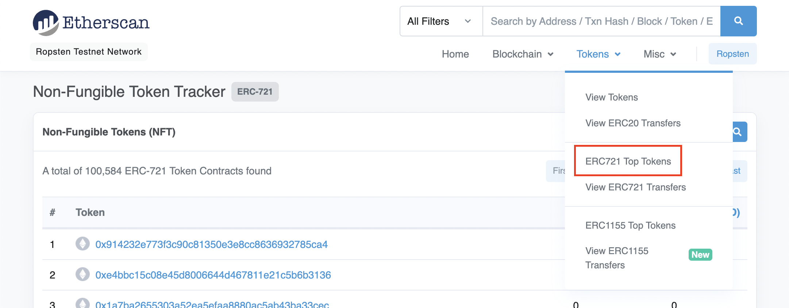
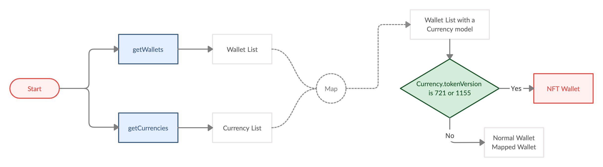

# NFT

- Bookmarks
  - [NFT Wallet](#nft-wallet-creation)
  - [NFT Balance](#balance)
  - [Deposit](#deposit)
  - [Withdraw](#withdraw)
  - [Transaction Detail](#transaction-detail)

## NFT Wallet Creation

- Suppose you'd like to receive some NFT tokens with Wallet SDK, but there's no that kind of `Currency` in the currency list, you can add NFT currency by calling `addContractCurrency`.  
If that kind of `Currency` is already exist, there's no need to add again.

```swift
/// [NFT] Add a new token & create first wallet
/// - Parameters:
///   - currency: Currency of desired new wallet
///   - contractAddress: Token address for tokens, i.e. an ERC-20 token wallet maps to an Ethereum wallet
///   - pinSecret: PIN secret retrieved via PinCodeInputView
///   - completion: asynchronous callback of WalletID
public func addContractCurrency(currency: Int64, contractAddress: String, pinSecret: CYBAVOWallet.PinSecret, completion: @escaping CYBAVOWallet.Callback<CYBAVOWallet.AddContractCurrenciesResult>)

/// Batch version of addContractCurrency
public func addContractCurrencies(currency: [Int64], contractAddress: [String], pinSecret: CYBAVOWallet.PinSecret, completion: @escaping CYBAVOWallet.Callback<CYBAVOWallet.AddContractCurrenciesResult>)
```

- How to get contract address?  
You can find it on blockchain explorer.  
Take CryptoKitties for example, you can find its contract address on Etherscan 
  

## NFT Wallet List



- Same way as we mentioned in [Wallet Information](wallets.md#wallet-information)
- Conditions:
  - `Wallet.isPrivate == false` ➜ it is on public chain
  - `tokenAddress != ""` ➜ it is a mapped wallet (NFT wallet is also mapped wallet)
  - `Currency.tokenVersion == 721 || 1155` ➜ it is an NFT wallet

## Balance

refer to [Balance](wallets.md#getbalances)

```swift
protocol Balance {

    var tokens: [String] { get } /** Non-Fungible Token IDs for ERC-721*/

    var tokenIdAmounts: [CYBAVOWallet.TokenIdAmount] { get } /** Non-Fungible Token ID and amounts for ERC-1155 */

    ...
}
```

- if ERC-721 (NFT), use `tokens`
- if ERC-1155 (NFT), use `tokenIdAmounts`

- In order to present images, call `getMultipleTokenUri` to get token urls.
  
  ```swift
  /// Get NFT Token URI
  /// - Parameters:
  ///   - currency: Currency of token to query
  ///   - tokenAddresses: Array of token address to query
  ///   - tokenIds: Array of token address to query
  ///   - completion: asynchronous callback of [String : CYBAVOWallet.TokenUriInfo]
  public func getMultipleTokenUri(currency: Int, tokenAddresses: [String], tokenIds: [String], completion: @escaping CYBAVOWallet.Callback<CYBAVOWallet.GetMultipleTokenUriReponse>)
  ```
### Error Handling

- for ERC-1155

  ```swift
  /// If ERC-1155 token didn't show in wallet's balance, register token ID manually make them in track
  /// - Parameters:
  ///   - walletId: walletId Wallet ID
  ///   - tokenIds: ERC-1155 token IDs for register
  ///   - completion: asynchronous callback
  public func registerTokenIds(walletId: Int64, tokenIds: [String], completion: @escaping CYBAVOWallet.Callback<CYBAVOWallet.RegisterTokenIdsResult>)
  ```

## Deposit

- Select a wallet address, create a new one if needed.
- Generate QR code
- Present the QR code for deposit.

## Withdraw

- The steps are similar to normal transactions. Refer to [Withdraw](transaction.md#withdraw)
- when `createTransaction()`
  - for [EIP-721](https://eips.ethereum.org/EIPS/eip-721) , set parameter `amount = tokenId`
  - for [EIP-1155](https://eips.ethereum.org/EIPS/eip-1155) , set parameter `amount = {token_amount}` and `extras = ["token_id": tokenId]`

## Transaction Detail

- The steps are similar to normal transactions. Refer to [getHistory](transaction.md#gethistory)

