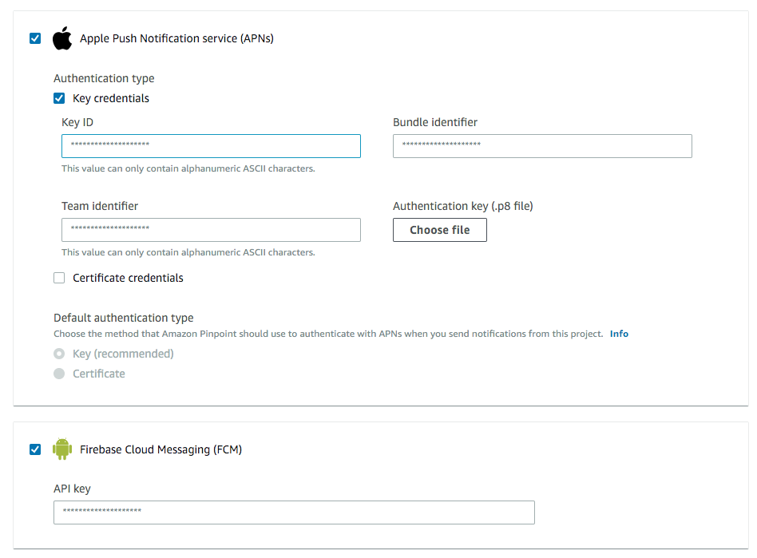
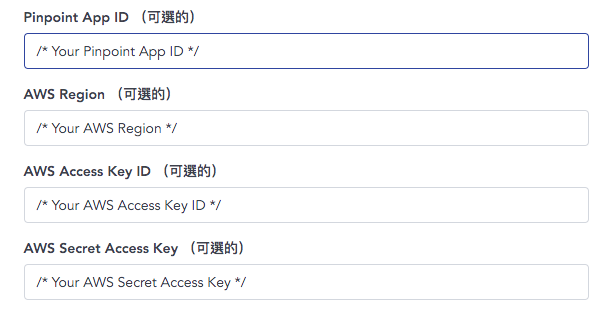

# Setup push notification
## Requirements
- iOS wallet sdk `'CYBAVOWallet', '~> 1.2.161'`
## Installation and configuration
1. Install and configure AWS Amplify push notification, please refer to [this](https://aws-amplify.github.io/docs/js/push-notifications).
2. Setup AWS Mobile Hub.
    1. Create an app in [AWS Mobile Hub](https://console.aws.amazon.com/mobilehub/home#/). 
    2. Click on the app in AWS Mobile Hub. You can get app id from URL `https://console.aws.amazon.com/mobilehub/home#/xxxx_appid_xxxx/build`

    3. Create an IAM user with following policy applied. (Replace *xxxx_appid_xxxx* with your app id)
    ```
    {
        "Version": "2012-10-17",
        "Statement": [
            {
                "Sid": "VisualEditor0",
                "Effect": "Allow",
                "Action": "mobiletargeting:SendMessages",
                "Resource": [
                    "arn:aws:mobiletargeting:*:*:apps/xxxx_appid_xxxx/campaigns/*",
                    "arn:aws:mobiletargeting:*:*:apps/xxxx_appid_xxxx/segments/*",
                    "arn:aws:mobiletargeting:*:*:apps/xxxx_appid_xxxx/messages"
                ]
            }
        ]
    }
    ```
    4. Go to `https://console.aws.amazon.com/pinpoint/home#/apps/xxxx_appid_xxxx/settings/push/edit` to config your creditial for android/ios
    

    5. Follow steps in [Setting Up Push Notifications for Amazon Pinpoint](https://docs.aws.amazon.com/pinpoint/latest/developerguide/mobile-push.html) to setup your pinpoint projects

    6. Generates access key of IAM user and setup in **CYBAVO VAULT** -> **System Settings** -> **App Settings** -> 
    

    7. Ready to test!
## Working with the API
1. For iOS, you can set if it's apns sandbox while init WalletSdk
    ```swift
   WalletSdk.shared.apnsSandbox = true
    ```
2. Please remember to call `Auth.setPushDeviceToken(token)` after signin. Otherwise the device won't be able to receive notification successfully. 
    ```swift
    //Keep the token after receive
    func application(_ application: UIApplication, didRegisterForRemoteNotificationsWithDeviceToken deviceToken: Data) {
        let tokenParts = deviceToken.map { data in String(format: "%02.2hhx", data) }
        let token = tokenParts.joined()
        
        PushDeviceToken = token
    }
   
   //Make sure call setPushDeviceToken after signin. 
   Auth.shared.setPushDeviceToken(deviceToken: PushDeviceToken) { result in
       switch result {
       case .success(_):
           print("cybavo setPushDeviceToken done")
           break
       case .failure(let error):
           print("cybavo setPushDeviceToken error \(error)")
           break
       }
   }
    ```
3. Receive the notification and display.
    
    ```swift
     func application(_ application: UIApplication, didReceiveRemoteNotification userInfo: [AnyHashable: Any], fetchCompletionHandler completionHandler: @escaping (UIBackgroundFetchResult) -> Void) {
        guard let data = userInfo["data"] as? [String: AnyObject] else {
            completionHandler(.failed)
            return
        }
        
        guard let jsonBody = data["jsonBody"] as? [String: String] else {
            completionHandler(.failed)
            return
        }
        let amount = jsonBody["amount"] as! String
        let from = jsonBody["from_address"]as! String
        let to = jsonBody["to_address"]as! String
        let out = jsonBody["out"]as! String
        let content = UNMutableNotificationContent()
        
        if(out == "true"){
            content.title = "Transaction Send"
            content.body = "Amount \(amount) from \(from)"
        }else{
            content.title = "Transaction Received"
            content.body = "Amount \(amount) to \(to)"
        }
        content.badge = 1
        content.sound = UNNotificationSound.default
        print("didReceiveRemoteNotification \(content.title)_\(content.body)")
        let trigger = UNTimeIntervalNotificationTrigger(timeInterval: 0.1, repeats: false)
        let request = UNNotificationRequest(identifier: "notification1", content: content, trigger: trigger)
        UNUserNotificationCenter.current().add(request, withCompletionHandler: nil)
        
        completionHandler(.newData)
    }
    ```
