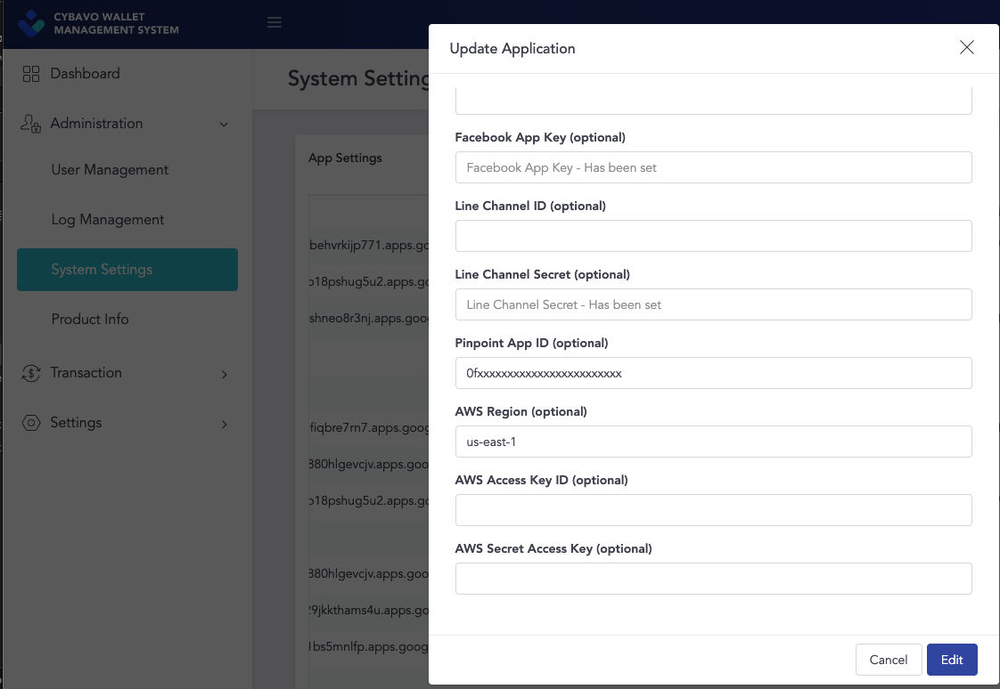

# Setup push notification
## Requirements
- iOS wallet sdk `'CYBAVOWallet', '~> 1.2.161'`
## Installation and configuration
1. Install and configure AWS Amplify push notification, please refer to [this](https://aws-amplify.github.io/docs/js/push-notifications).
2. Setup AWS Mobile Hub. Please refer to [this](../docs/PushNotificationAws.md).
3. Add following information of your app on `CYBAVO wallet management system` 
    1. Pinpoint App ID
    2. AWS Region
    3. AWS Access Key ID
    4. AWS Secret Access Key
    
    
## Working with the API
1. For iOS, you can set if it's apns sandbox while init WalletSdk
    ```swift
   WalletSdk.shared.apnsSandbox = true
    ```
2. After receive the push token, call Auth.setPushDeviceToken
    ```swift
    func application(_ application: UIApplication, didRegisterForRemoteNotificationsWithDeviceToken deviceToken: Data) {
        let tokenParts = deviceToken.map { data in String(format: "%02.2hhx", data) }
        let token = tokenParts.joined()
        
        PushDeviceToken = token
    }
   
   //This function should be called once signin
   Auth.shared.setPushDeviceToken(deviceToken: PushDeviceToken) { result in
       switch result {
       case .success(_):
           print("cybavo setPushDeviceToken done")
           break
       case .failure(let error):
           print("cybavo setPushDeviceToken error \(error)")
           break
       }
   }
    ```
3. Receive the notification and display.
    
    ```swift
     func application(_ application: UIApplication, didReceiveRemoteNotification userInfo: [AnyHashable: Any], fetchCompletionHandler completionHandler: @escaping (UIBackgroundFetchResult) -> Void) {
        guard let data = userInfo["data"] as? [String: AnyObject] else {
            completionHandler(.failed)
            return
        }
        
        guard let jsonBody = data["jsonBody"] as? [String: String] else {
            completionHandler(.failed)
            return
        }
        let amount = jsonBody["amount"] as! String
        let from = jsonBody["from_address"]as! String
        let to = jsonBody["to_address"]as! String
        let out = jsonBody["out"]as! String
        let content = UNMutableNotificationContent()
        
        if(out == "true"){
            content.title = "Transaction Send"
            content.body = "Amount \(amount) from \(from)"
        }else{
            content.title = "Transaction Received"
            content.body = "Amount \(amount) to \(to)"
        }
        content.badge = 1
        content.sound = UNNotificationSound.default
        print("didReceiveRemoteNotification \(content.title)_\(content.body)")
        let trigger = UNTimeIntervalNotificationTrigger(timeInterval: 0.1, repeats: false)
        let request = UNNotificationRequest(identifier: "notification1", content: content, trigger: trigger)
        UNUserNotificationCenter.current().add(request, withCompletionHandler: nil)
        
        completionHandler(.newData)
    }
    ```
