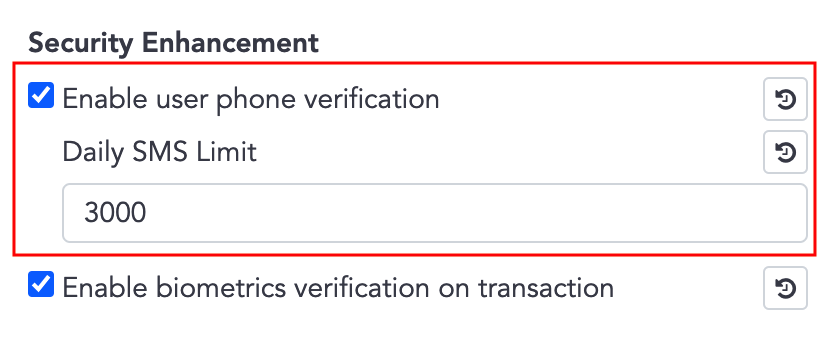
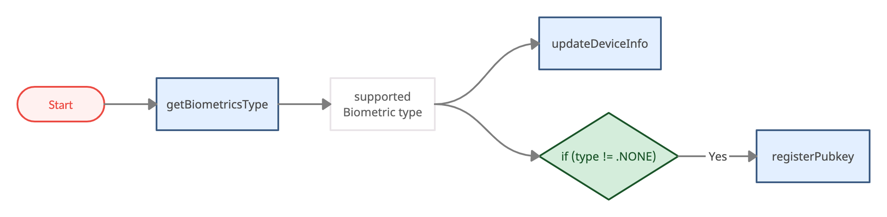

# Security Enhancement
- Security enhancement is optional, after activated, WalletSDK will require further authentication while sign-in and transaction / sign operation.
- Bookmarks
  - [Enable User Phone Verification](#enable-user-phone-verification)
  - [Skipping SMS Verify](#skipping-sms-verify)
  - [Enable Biometrics Verification on Transaction](#enable-biometrics-verification-on-transaction)
  - [APIs which Required Biometrics Verification](#apis-which-required-biometrics-verification)

## Enable User Phone Verification
- On the **admin panel** ➜ **System settings** ➜ **Security Enhancement**, you can activate **Enable user phone verification** which means require phone verification when user sign-in on a new device.

     
### SignInState for Register flow
1. Activated this option on the admin panel.
2. When App invokes Wallets API, ex. `getCurrencies()`, server will check if the user registered the phone and is verified on this device. If not, WalletSDK will invoke `SignInStateDelegate.onUserStateChanged()` with `.needRegisterPhone` or `.needVerifyOtp`.
```swift
class MainViewController: UIViewController {
  override func viewDidLoad() {
    Auth.shared.addSignInStateDelegate(self)
    Auth.shared.getSignInState()
  }
}

extension MainViewController : SignInStateDelegate {
    func onUserStateChanged(state: SignInState) {
        switch state {
            case .needRegisterPhone:
                // Lead user to the register phone page
                break
            case .needVerifyOtp:
                // Lead user to the verify OTP page
                break
            ...
        }
    }
}
```
#### Register Phone - .needRegisterPhone 
3. Receiving `.needRegisterPhone` means the user hasn't registered a phone number, leading the user to the register phone page.
4. Invoke `registerPhoneNumber()` to send SMS and get `actionToken`.  
  In the case which need resend SMS, ex. SMS expired, just invoke `registerPhoneNumber()` again.
5. Invoke `verifyOtp()` with user input OTP and `actionToken`.
6. Wallets API can be invoked normally now, you can bring the user back to the main page.
```swift
// Step 4.
Auth.shared.registerPhoneNumber(
    contryCode: contryCode, //ex."+886"
    phone: phone, // ex."902345678"
    duration: SMS_COOL_TIME_SEC){ // SMS expire duration in second, minimum value is 60, ex. 60
        result in
            switch result {
                case .success(_):
                    // Keep result.actionToken for verifyOtp()
                    break
                case .failure(let error):
                    print("registerPhoneNumber error \(error)")
                    break
                }
}
// Step 5.
Auth.shared.verifyOtp(
    actionToken: actionToken, // From result of registerPhoneNumber()
    code: smsCode){ // Input by user
        result in
        switch result {
            case .success(_):
                //Step 6. bring user back to the main page
                break
            case .failure(let error):
                print("verifyOtp error \(error)")
                break
            }
    
}
```
#### Verify OTP while Signing on New Device - .needVerifyOtp
3. Receiving `.needVerifyOtp` means the user has registered the phone, but signed in on a new device, leading the user to the verify OTP page.
4. Invoke `getLoginSmsCode()` to send SMS and get `actionToken`.  
  In the case which need resend SMS, ex. SMS expired, just invoke `getLoginSmsCode()` again.
5. Invoke `verifyOtp()` with user input OTP and `actionToken`.
6. Wallets API can be invoked normally now, you can bring the user back to the main page.
```swift
// Step 4.
Wallets.shared.getLoginSmsCode(duration: SMS_COOL_TIME_SEC){ // SMS expire duration in second, minimum value is 60, ex. 60
            result in
                switch result {
                    case .success(_):
                        // Keep result.actionToken for verifyOtp()
                        break
                    case .failure(let error):
                        print("getLoginSmsCode error \(error)")
                        break
                    }
}
// Step 5.
Auth.shared.verifyOtp(
            actionToken: actionToken, // From result of getLoginSmsCode()
            code: smsCode){ // Input by user
                result in
                switch result {
                    case .success(_):
                        //Step 6. bring user back to the main page
                        break
                    case .failure(let error):
                        print("registerPhoneNumber error \(error)")
                        break
                    }
            
        }     
```

## Skipping SMS Verify

- Although security enhancement is applied globally, in **User Management**, the administrator still can set a single user to skip SMS / biometrics verification.


   
- By checking `UserState`, you can get to know whether the user is required verify or not.
  -  `enableBiometrics`  
      Mapping to **admin panel** ➜ **System settings** ➜ **Security Enhancement** ➜ **Enable biometrics verification on transaction**.
  -  `skipSmsVerify`  
      Mapping to **admin panel** ➜ **User Management** ➜ click signal user ➜ **Skip SMS verification**.
  -  `accountSkipSmsVerify`  
      Not configurable.

    ```swift
    public protocol UserState {

        var enableBiometrics: Bool { get } // Is enable biometric authentication

        var skipSmsVerify: Bool { get } // Is skip SMS/Biometrics verify

        var accountSkipSmsVerify: Bool { get } // Is skip SMS for specific case, ex. Apple account

        ...
    }
    ```

- `if (enableBiometrics && !skipSmsVerify)` ➜ need biometrics / SMS verification for transaction and sign operation

- `if (accountSkipSmsVerify == true)` ➜ cannot use SMS for verification, use biometrics verification instead.

    ex. For Apple Sign-In account,  only biometrics verification is available.
## Enable Biometrics Verification on Transaction
- On the **admin panel** ➜ **System settings** ➜ **Security Enhancement**, you can activate **Enable biometrics verification on transaction** which means require biometrics verification (or SMS verification if the device does not support biometrics) while performing transaction or sign operations.  
Related APIs are listed in [APIs which Required Biometrics Verification](#apis-which-required-biometrics-verification).
- If **Enable biometrics verification on transaction** is activated, the system will also activate **Enable user phone verification**.

     
### Setup for Biometrics Verification


- Complete the setup before using [APIs which Required Biometrics Verification](#apis-which-required-biometrics-verification).
1. Check if the user needs biometrics / SMS verification
2. Call `updateDeviceInfo()`, this step is telling server if the device able to use biometrics or not.
    ```swift
    // Update device's biometrics type, pass nil WalletSDK will decide the type
    Wallets.shared.updateDeviceInfo(type: nil){ result in ... }

    // Update device's biometrics type with specific type
    // Passing BiometricsType.NONE means you'll use SMS verification instead of biometrics.
   Wallets.shared.updateDeviceInfo(type: BiometryType.NONE.rawValue){ result in ... }
    ```
3. Call `getBiometricsType()` to get supported biometric type
4. `if BiometryType != BiometricsType.NONE` ➜ call `registerPubkey()`
5. `if BiometryType == BiometricsType.NONE` && `accountSkipSmsVerify()` ➜ prompt error. ex. The device not supporting biometrics, please contact the system admin.

  ```swift
  func checkAndRegisterPubkey(accountSkipSmsVerify: Bool){
      // Step 3.
      let type = Wallets.shared.getBiometricsType() // BiometryType { NONE / FACE / FINGER }
      if accountSkipSmsVerify && type == BiometryType.NONE{
          // Step 5. prompt error. ex. "The device not supporting biometrics, please contact the system admin."
          return
      }
      // Step 2. update device's biometrics type
      Wallets.shared.updateDeviceInfo(type: type.rawValue){ result in
          switch result {
              case .success(_):
                  self.registerPubKey(type: type)
                  break
              case .failure(let error):
                  print("updateDeviceInfo error \(error)")
                  self.registerPubKey(type: type)
                  break
              }
      }
  }
  
  // Step 4.
  func registerPubKey(type: BiometryType){
      if type == BiometryType.NONE{
          return
      }
      //Register public key for biometrics authentication
      Wallets.shared.registerPubkey(){ result in
          switch result {
              case .success(_):
                  //Setup completed, you can use APIs which required biometrics verification
                  break
              case .failure(let error):
                  print("registerPubkey error \(error)")
                  break
              }
          
      }
  }
  ```
## APIs which Required Biometrics Verification 

- There are two versions (biometrics and SMS) for following transaction  / sign APIs:
  - createTransaction
  - requestSecureToken
  - signRawTx
  - increaseTransactionFee
  - callAbiFunction
  - cancelTransaction
  - callAbiFunctionTransaction
  - signMessage
  - walletConnectSignTypedData
  - walletConnectSignTransaction
  - walletConnectSignMessage
  - cancelWalletConnectTransaction
  - commonSignRawTx
  - setSolTokenAccountTransaction

- SMS version has the suffix 'Sms', ex. createTransactionSms
- Biometrics version has the suffix 'Bio', ex. createTransactionBio

### SMS version usage
1. Invoke `getTransactionSmsCode()` to send SMS and get `actionToken`.
2. Invoke SMS version function with user input OTP, `actionToken`.  
Other parameters are same as usual.
```swift
// Step 1.
Wallets.shared.getTransactionSmsCode(duration: SMS_COOL_TIME_SEC){ // SMS expire duration in second, minimum value is 60, ex. 60
            result in
                switch result {
                    case .success(_):
                        // Keep result.actionToken for next step. ex. calling createTransactionSms()
                        break
                    case .failure(let error):
                        print("getTransactionSmsCode error \(error)")
                        break
                    }
        }
// Step 2.  
Wallets.shared.createTransactionSms(
            actionToken: actionToken, // From result of getTransactionSmsCode()
            smsCode: smsCode, // Input by user
            fromWalletId: fromWalletId, toAddress: toAddress, amount: amount, transactionFee: transactionFee, description: description){ result in ...}
```

### Biometrics version usage
1. Invoke biometrics version funtion with `promptMessage`.  
Other parameters are same as usual.
```swift
Wallets.shared.createTransactionBio(
            promptMessage: promptMessage,
            fromWalletId: fromWalletId, toAddress: toAddress, amount: amount, transactionFee: transactionFee, description: description){ result in ... }
```