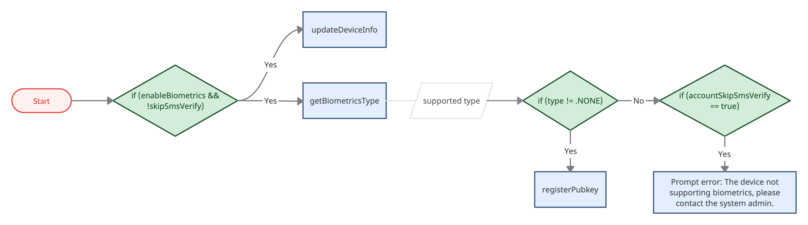

# Biometrics & SMS Verification

- Bookmarks
  - [UserState](#userstate)
  - [Setup](#biometrics--sms-verification-setup)
  - [Functions](#biometrics--sms-verification-for-transaction-and-sign-operation)

## UserState

- Biometrics verification is controlled in the Security Enhancement section on the admin panel.  

  

- Although biometrics verification is applied globally, in User Management, the administrator still can set a single user to skip SMS / biometrics verification.

  

   

    ```swift
    public protocol UserState {

        var enableBiometrics: Bool { get } // Is enable biometric authentication

        var skipSmsVerify: Bool { get } // Is skip SMS/Biometrics verify

        var accountSkipSmsVerify: Bool { get } // Is skip SMS for specific case, ex. Apple account

        ...
    }
    ```

- `if (enableBiometrics && !skipSmsVerify)` ➜ need biometrics / SMS verification for transaction and sign operation

- `if (accountSkipSmsVerify == true)` ➜ cannot use SMS for verification, use biometrics verification instead.

    e.g. Only biometrics verification available for Apple Sign-In account.

## Biometrics / SMS Verification Setup



- Must be set up before performing APIs which are mentioned in the next section.
- Steps:
    1. Check if the user needs biometrics / SMS verification
    2. Call `updateDeviceInfo`, pass nil Wallet SDK will decide the value for you.
        - Pass `.NONE` means you are registering for SMS verification
    3. Call `getBiometricsType` ➜ supported biometric type
    4. `if (BiometryType != .NONE)` ➜ call `registerPubkey`
    5. `if (BiometryType == .NONE)` && `accountSkipSmsVerify` ➜ prompt error. ex. The device not supporting biometrics, please contact the system admin.

```swift
/// Get device's biometrics type
/// - Returns: BiometryType { NONE / FACE / FINGER }
public func getBiometricsType() -> CYBAVOWallet.BiometryType

/// Update device's biometrics type, detect type by sdk
/// - Parameters:
///   - type: BiometricsType's raw value, pass nil WalletSDK will decide the value for you
///   - completion: asynchronous callback
public func updateDeviceInfo(type: Int?, completion: @escaping CYBAVOWallet.Callback<CYBAVOWallet.UpdateDeviceInfoResult>)

/// register public key for biometrics authentication
public func registerPubkey(completion: @escaping CYBAVOWallet.Callback<CYBAVOWallet.RegisterPubkeyResult>)
```

## Biometrics / SMS Verification for transaction and sign operation

- There are two versions (biometrics and SMS) for following transaction  / sign APIs:
  - createTransaction
  - requestSecureToken
  - signRawTx
  - increaseTransactionFee
  - callAbiFunction
  - cancelTransaction
  - callAbiFunctionTransaction
  - signMessage
  - walletConnectSignTypedData
  - walletConnectSignTransaction
  - walletConnectSignMessage
  - cancelWalletConnectTransaction

- SMS version has the suffix 'Sms', ex. createTransactionSms
- Biometrics version has the suffix 'Bio', ex. createTransactionBio

### SMS version

- call `getTransactionSmsCode` to send a SMS to the user

    ```swift
    /// get SMS code for transaction
    /// - Parameters:
    ///   - duration: SMS expire duration (second), ex. 60
    ///   - completion: asynchronous callback
    public func getTransactionSmsCode(duration: Int64, completion: @escaping CYBAVOWallet.Callback<CYBAVOWallet.GetActionTokenResult>)
    ```

- `actionToken` + `OTP code` + `PinSecret / PinCode` ➜ call SMS version function

### Biometrics version

- `promptMessage` + `PinSecret / PinCode` ➜ call biometrics version function
