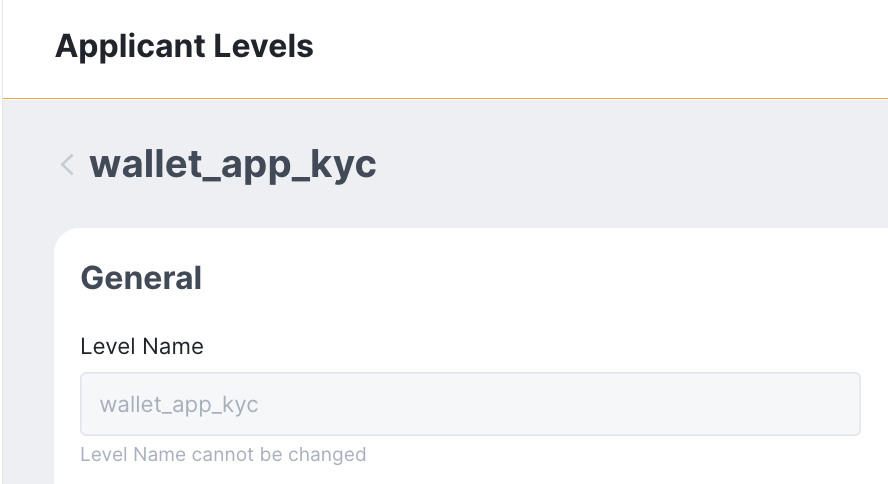
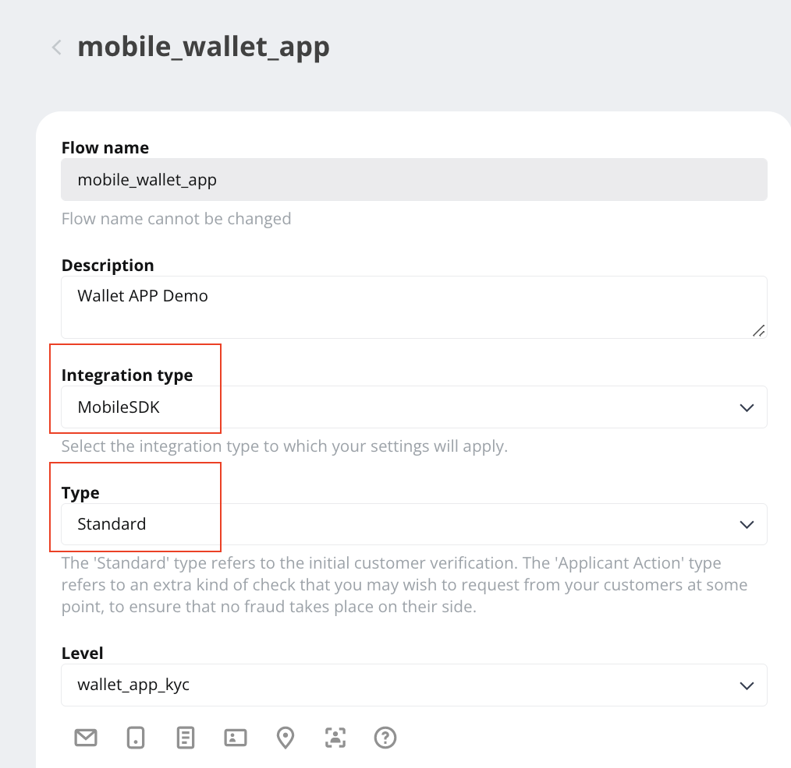

# KYC with Sumsub

> For KYC requirement, Wallet SDK has integrated with [Sumsub](https://sumsub.com/) and provides corresponding API for launching [Sumsub MSDK](https://developers.sumsub.com/msdk/#getting-started) and sharing data.


- Bookmark:
  - [Preparation](#preparation)
  - [Create an Applicant](#create-an-applicant)
  - [Access Token and Launching Sumsub MSDK](#access-token-and-launching-sumsub-msdk)
  - [Sharing Applicants between Partner Services](#sharing-applicants-between-partner-services)

## Preparation

1. Wallet SDK has implemented some of tasks in [MSDK's backend routines](https://developers.sumsub.com/msdk/#backend-routines) for  you. Please go to the **admin panel** ➜ navigate to **App settings** ➜ add below configurations for the target App:  
    - Sumsub Server URL: can be `https://api.sumsub.com`. For more detail, please see [this](https://developers.sumsub.com/api-reference/#introduction). 
    - Sumsub Token: generate on [Sumsub dashboard](https://cockpit.sumsub.com/checkus?_gl=1*1qzwmb0*_ga*MTY0OTA2OTIzNy4xNjQ2NjM2ODE4*_ga_ZF910PGWRL*MTY1MjE4MzU0OC44MS4xLjE2NTIxODkyMzIuNTI.#/devSpace/appTokens). For more detail, please see [this](https://developers.sumsub.com/api-reference/#app-tokens).
    - Sumsub Secret: as above, **_Sumsub Token_**.
    - Sumsub Level Name: [set up your applicant level](https://api.sumsub.com/checkus?_gl=1*15coo51*_ga*MTY0OTA2OTIzNy4xNjQ2NjM2ODE4*_ga_ZF910PGWRL*MTY1MjE4MzU0OC44MS4xLjE2NTIxOTAzMzUuNjA.#/sdkIntegrations/levels) and fill the name here.  

        
    - Sumsub Access Token TTL: time to live for the token, in second.
    - Sumsub Flow Name: [set up your applicant flow](https://api.sumsub.com/checkus?_gl=1*1ccutv*_ga*MTY0OTA2OTIzNy4xNjQ2NjM2ODE4*_ga_ZF910PGWRL*MTY1MjE4MzU0OC44MS4xLjE2NTIxOTA4ODEuNjA.#/sdkIntegrations/flows) and fill the name here.  
⚠️ Please note that must select `MobileSDK` for "Integration type" and select `Standard` for "Type"

        
    * You can use `Auth.shared.checkKycSetting()` to check if `Sumsub Server URL`, `Sumsub Token` and `Sumsub Secret` are set properly and display / hide related UI.

        ```swift
        /// Check if the KYC settings exist:
        ///                 Sumsub server URL
        ///                 Sumsub Token
        ///                 Sumsub Secret
        /// - Parameters:
        ///   - completion: Asynchronized callback
        public func checkKycSetting(completion: @escaping Callback<CheckKycSettingResult>)
        ```
3. [Sumsub MSDK installation](https://developers.sumsub.com/msdk/ios/#installation)    
    ⚠️ Version `1.19.4` or later is recommended.

    Specify in your `Podfile`:
    ```
    source 'https://cdn.cocoapods.org/'
    source 'https://github.com/SumSubstance/Specs.git'

    target '<Your Target Name>' do
        pod 'IdensicMobileSDK'
    end
    ```
    Then run:
    ```
    pod install
    ```
    Update `Info.plist` to have description for the camera, microphone and the photo library usage
    
    ```xml
    <key>NSCameraUsageDescription</key>
    <string>Let us take a photo</string>
    <key>NSMicrophoneUsageDescription</key>
    <string>Time to record a video</string>
    <key>NSPhotoLibraryUsageDescription</key>
    <string>Let us pick a photo</string>
    ``` 
## Create an Applicant
- Use `Auth.shared.createKyc()` to create an applicant on Sumsub for the current user.
- Wallet SDK will use the user's `Unique token` as `External user ID`, therefore you can utilize those to mapping.
- Please note that an applicant will be created with `Sumsub Level Name` (see [this](https://developers.sumsub.com/api-reference/#creating-an-applicant)), if change `Sumsub Flow Name` to others which belongs to a different level name, launch MSDK may fail.
- In Sumsub sandbox environment, it seems that applicants being deleted is possible, which also will cause launch MSDK failed.

    ```swift
    ///
    /// Create KYC Applicant
    /// - Parameters:
    ///   - country: ISO ISO alpha-3 code of applicant
    ///   https://en.wikipedia.org/wiki/ISO_3166-1_alpha-3
    ///   - completion: Asynchronized callback
    public func createKyc(country: String, completion: @escaping Callback<CreateKycResult>)
    ```
## Access Token and Launching Sumsub MSDK
- Use `Auth.shared.getKycAccessToken()` and use the result to launch MSDK
- User must has called `createKyc` before this step, which means have an applicant on Sumsub dashboard.
- Please visit [Sumsub Developer Hub](https://developers.sumsub.com/msdk/ios/#initialization) for detailed MSDK instruction .

    ```swift
    import IdensicMobileSDK
    
    Auth.shared.getKycAccessToken(){ result in
                    switch result{
                        case .success(let result):
                            launchSNSMobileSDK(accessToken: result.token)
                            break;
                        case .failure(let error):
                            print("getKycAccessToken failed \(error)")
                            break;
                    }
                    
    }
    
    func launchSNSMobileSDK(accessToken: String) {
        let sdk = SNSMobileSDK(accessToken: accessToken)
        guard sdk.isReady else {
            print("Initialization failed: " + sdk.verboseStatus)
            return
        }
        sdk.tokenExpirationHandler{(onComplete) in
            Auth.shared.getKycAccessToken(){ result in
                switch result{
                    case .success(let result):
                        onComplete(accessToken)
                        break;
                    case .failure(let error):
                        print("[tokenExpirationHandler] getKycAccessToken failed \(error)")
                        break;
                }
                
            }
        }
        sdk.present()
    }
    ```
## Sharing Applicants between Partner Services
- Sumsub also provides sharing which allows different services share applicant's KYC data via `share token`. Please visit their [API Reference](https://developers.sumsub.com/api-reference/#sharing-applicants-between-partner-services) for detailed introduction and instructions for `share token` use. 
- Use `Auth.shared.getKycShareToken()` to get `share token` for the current user.

    ```swift
    /// Get user's share token for KYC
    /// - Parameters:
    ///   - completion: Asynchronized callback
    public func getKycShareToken(completion: @escaping Callback<GetKycShareTokenResult>)
    ```