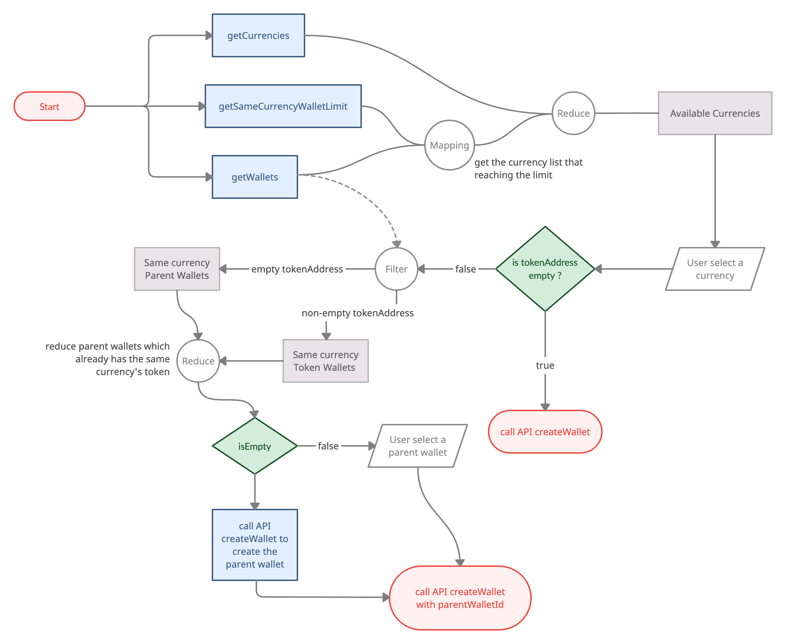
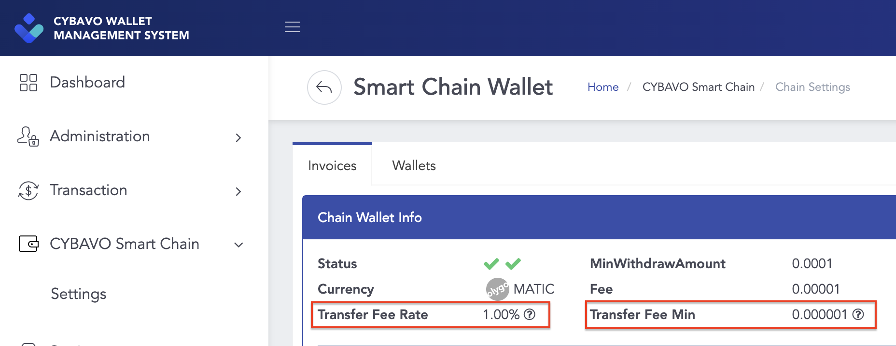

# Private Chain

- Private chain a.k.a. CYBAVO Private Smart Chain (CPSC)
- Scenario for:
  - Financial Products
  - Financial Management Services
  
- Advantages of a private chain:
    1. Free; zero transaction fee for inner transfer
    2. Faster; faster than public chain
    3. Community; referral system is possible

- Easy to implement, sharing APIs with the public chain.

- Bookmarks
  - [Model - Wallet](#wallet)
  - [Model - Currency](#currency)
  - [Model - UserState](#userstate)
  - [Transactions - Deposit to Private Chain](#1-deposit-to-private-chain)
  - [Transactions - Withdraw to Public Chain](#2-withdraw-to-public-chain)
  - [Transactions - Inner Transfer](#3-inner-transfer)
  - [Transaction History](#transaction-history)

## Models

### Wallet

```swift
protocol Wallet : CYBAVOWallet.BalanceAddress, CYBAVOWallet.CurrencyType {

    var walletId: Int64 { get } // Wallet ID

    var isPrivate: Bool { get } // Is private chain (CPSC)

    var mapToPublicCurrency: Int { get } // Public chain's currency

    var mapToPublicTokenAddress: String { get } // Public chain's tokenAddress

    var mapToPublicName: String { get } // Public chain's currency_name

    var walletCode: String { get } // Address(referral code) for transaction in private chain

    var depositAddresses: [CYBAVOWallet.DepositAddress] { get } // Deposit info, public chain to private chain

    var isPrivateDisabled: Bool { get } // Is disabled private currency
    
    ...
}
```

- `isPrivate` means the wallet is on the private chain
- Thus, it will map to a public currency on the public chain.  
  - related infos: `mapToPublicCurrency`, `mapToPublicTokenAddress`, `mapToPublicName`
- `depositAddresses` provides the addresses on the public chain. When you deposit currencies / tokens to these addresses, you will receive tokens in the related private chain wallet.
  - multiple `depositAddresses` means one private chain wallet might provide multiple addresses for depositing.
  - ex: CPSC-USDT on private chain is mapped to USDT-ERC20 and USDT-TRC20 on the public chains, so you will get multiple addresses in this field.
  - `memo` in model `DepositAddress` is necessary when depositing tokens from public chain to private chain.

### Currency

```swift
protocol Currency : CYBAVOWallet.CurrencyType {

    var isPrivate: Bool { get } // Is private chain (CPSC)

    var mapToPublicType: Int { get } // Public chain's currency type

    var mapToPublicTokenAddress: String { get } // Public chain's token address

    var mapToPublicName: String { get } // Public chain's currency name

    var canCreateFinanceWallet: Bool { get } // Can create finance wallet

    ...
}
```

- `isPrivate` means the currency is on the private chain
- Thus, it will map to a public currency on the public chain.  
  - related infos: `mapToPublicType`, `mapToPublicTokenAddress`, `mapToPublicName`, `canCreateFinanceWallet`

- How to create a private chain wallet with the currency?
  - Basically, it's the same way as we mentioned in [createWallet](wallets.md#createwallet), the only difference is the filtering condition of currency and wallet.
  - In the chart below, `Available Currencies` should be `isPrivate == true && (canCreateFinanceWallet == true || tokenAddress == "")`
  

### UserState

```swift
protocol UserState {

    var userReferralCode: String { get } // User referral code

    var linkUserReferralCode: String { get } // Link user referral code (referral by this code, only one per user)

    ...
}
```

- Referral Code has two use cases:
    1. referral system
    2. substitute readable address for making transactions in the private chain
- `userReferralCode` represent the user's referral code
- `linkUserReferralCode` represent the referrer's referral code
- Call `Auth.shared.registerReferralCode()` to register a referrer.
- You can search user by calling `Auth.shared.searchUser()`, the keyword can be `realName` (partial match) or `referralCode` (fully match)
  ```swift
  Auth.shared.searchUser(keyword: "UserX"){ result in
                    switch result {
                        case .success(let result):
                            for i in 0..<result.infos.count {
                                print("#\(i), Name: \(result.infos[i].realName), Code: \(result.infos[i].referralCode)")
                            }
                            break;
                        case .failure(let error):
                            //keyword length cannot less then 3,
                            //otherwise the API will receive ErrKeywordForSearchTooShort
                            print("searchUser failed \(error)")
                            break;
                    }
                }

  ```
- You can update `realName` by calling `Auth.shared.updateRealName()`
  ```swift
  Auth.shared.updateRealName(realName: "UserY"){ result in
                    switch result {
                    case .success(_):
                            Auth.shared.getUserState(){userStateResult in
                                switch userStateResult {
                                case .success(let userStateResult):
                                    print("newRealName: \(userStateResult.userState.realName)")
                                    break
                                case .failure(let userStateErr):
                                    print("getUserState failed \(userStateErr)")
                                    break
                                }
                            }
                            break;
                        case .failure(let error):
                            //realName length cannot less then 3,
                            //otherwise the API will receive ErrKeywordForSearchTooShort
                            print("updateRealName failed \(error)")
                            break;
                    }
                    
                }
  ```

## Transactions

- There are 3 types of transactions on the private chain.

### 1. Deposit to Private Chain

- Select a private wallet, create a new one if needed.
- Select a deposit address of the private wallet.
- Present the address and memo of the deposit address for deposit.

### 2. Withdraw to Public Chain

#### Get Transaction Fee

- Withdrawing to public chain will be charged a fixed transaction fee.  
i.e. `getTransactionFee()` will return the same amount of { high, medium, low } level for private chain currency.
- Use `wallet.depositAddress` 's `Currency` and `tokenAddress` as parameters to get the transaction fee for withdraw to public chain.
- The { receive amount = transfer amount - transaction fee }
- The receive amount cannot less than `withdrawMin`

```swift
public protocol GetTransactionFeeResult {
    
    var withdrawMin: String { get } // Minimum transfer amount for private
    
    ...
}
```

#### Perform Withdraw

- Call `callAbiFunctionTransaction()` to perform the transaction with specific parameters:

```swift
let depositAddress = wallet.depositAddress[0] //select a deposit address
let args: [Any] = [toAddress,
                   transferAmount, //ex. "123.123456"
                   memo, // optional, ex. "123456" 
                   "\(depositAddress.mapToPublicCurrency)", //ex. "60"
                   depositAddress.mapToPublicTokenAddress], 

Wallets.shared.callAbiFunctionTransaction(walletId: walletId, 
                    name: "burn", // fixed to "burn"
                    contractAddress: wallet.tokenAddress, 
                    abiJson: "", // fixed to ""
                    args: args, 
                    transactionFee: "0", //our backend will take care of this 
                    pinSecret: pinSecret) {result in ... }
```

### 3. Inner Transfer

#### Private Chain Platform Fee
- On the **admin panel** ➜ **CYBAVO Smart Chain** ➜ **Chain Settings**, choose a currency which supports platform fee, click **Manage** button ➜ **Chain Wallet info**, you can found **Transfer Fee Rate** and **Transfer Fee Min**.  

  
- All the transfer operation on private chain will be charged platform fee, including inner transfer and transaction for finance product, not including deposit to private chain and withdraw to public chain. 
- Platform fee calculation:
  1. Platform Fee = Transfer Amount * **Transfer Fee Rate**
  2. If the result of step 1 is less then **Transfer Fee Min**, use **Transfer Fee Min**.
  3. If the currency not supported platform fee, the `platformFee` will be `"0"`
- You can use `estimateTransaction()` to get the platfom fee:
  ```swift
  Wallets.shared.estimateTransaction(
                    currency: wallet.currency,
                    tokenAddress: wallet.tokenAddress,
                    amount: amount, // ex. "100"
                    transactionFee: "0", //fixed to "0"
                    walletId: wallet.walletId){result in
                      switch result {
                          case .success(let result):
                              //check result.platformFee
                              break
                          case .failure(let error):
                              print("estimateTransaction failed: \(error)")
                              break
                      }
                }
  ```
#### Create Transaction
- Call `createTransaction()` to perform the transaction with specific parameters:

```swift
let extras = ["kind": "code"] //means it's a inner transfer transaction

Wallets.shared.createTransaction(fromWalletId: walletId,
                    toAddress: toAddress, //other user's userReferralCode, ex. "8X372G"
                    amount: transferAmount, //ex. "123.123456"
                    transactionFee: "0", // fixed to "0"
                    description: description,
                    pinSecret: pinSecret,
                    extras: extras)  { result in ... }
```

## Transaction History

- Basically, it's the same way as we mentioned in [transaction.md](transaction.md).  
 The only different thing is the parameter `crosschain` of `getHistory()`:
  - Pass `crosschain: 1`, it returns transactions of [Deposit to Private Chain](#deposit-to-private-chain) and [Withdraw to Public Chain](#withdraw-to-public-chain)
  - Pass `crosschain: 0`, it returns transactions of [Inner Transfer](#inner-transfer).
