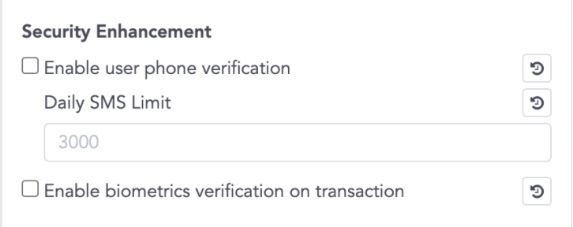

# CYBAVO Wallet APP SDK (for iOS) - Guideline

> Welcome to CYBAVO Wallet APP SDK (for iOS) - Guideline

The **CYBAVO Wallet APP SDK** provides a thorough solution for building Institutional-grade security wallets.  
It provides both high-level and low-level APIs for nearly all **CYBAVO Wallet APP** features, backed by **CYBAVO** private key protection technology.

- Category
  - [SDK Guideline](#sdk-guideline)
  - [Auth](#auth)
  - [PIN Code](#pin-code)
  - Wallets ➜ [wallets.md](wallets.md)
  - Transaction ➜ [transaction.md](transaction.md)
  - Biometrics & SMS ➜ [bio_n_sms.md](bio_n_sms.md)
  - [Push Notification](#push-notification)
  - [Others](#others)
  - Advanced
    - NFT ➜ [NFT.md](NFT.md)
    - WalletConnect ➜ [wallet_connect.md](wallet_connect.md)
    - Private Chain ➜ [private_chain.md](private_chain.md)
    - KYC with Sumsub ➜ [kyc_sumsub.md](kyc_sumsub.md)

## SDK Guideline

### Prerequisite

Please contact **CYBAVO** to get your `endPoint` and `apiCode`.

### Installation

- CocoaPods `1.1.0+` is required to build `CYBAVOWallet 1.2.0+`  
- specify in your `Podfile`:

    ```sh
    source 'https://github.com/CocoaPods/Specs.git'
    source 'https://bitbucket.org/cybavo/Specs_512.git'

    platform :ios, '14.0'
    use_frameworks!

    target '<Your Target Name>' do
        pod 'CYBAVOWallet', '~> 1.2.0'
    end
    ```

- Then, run the following command:  

    ```shell
    pod install
    ```

### Setup

- Add the following code in your `AppDelegate.swift`, or your WalletSDK Manager.

  ```swift
  WalletSdk.shared.endPoint = <Your endpoint url>
  WalletSdk.shared.apiCode = <Your API code>
  ```

- See this : [Sandbox Environment](#sandbox-environment)

### APP Flowchart


### First-time login tasks


[↑ go to the top ↑](#cybavo-wallet-app-sdk-for-ios---guideline)

---

# Auth

## Sign-in / Sign-up Flowchart


## Third-Party login

  Supported services : Apple / Google / Facebook / LINE / Twitter / WeChat

## Sign-in flow

- 3rd party login ➡️ `Auth.signIn` ➡️ get success ➡️ wait for `SignInStateDelegate` update
  
- 3rd party login ➡️ `Auth.signIn` ➡️ get `.ErrRegistrationRequired` ➡️ Sign-up flow

```swift
/// sign-in with CYBAVOWallet Auth
///
/// - Parameters:
///   - token: Token String from different 3rd party SDK
///     1. Apple - authorization.credential.identityToken
///     2. Google - user.authentication.idToken
///     3. Facebook - AccessToken.current.tokenString
///     4. LINE - LoginResult.accessToken.value
///     5. Twitter - identity token
///     6. WeChat - identity token
///
///   - identityProvider: String of provider
///     1. Apple - "Apple"
///     2. Google - "Google"
///     3. Facebook - "Facebook"
///     4. LINE - "LINE"
///     5. Twitter - "Twitter"
///     6. WeChat - "WeChat"
///
///   - extras: Extra attributes for specific provider, pass null if unspecified.
///     1. id_token_secret (String) - Secret for Twitter
///
///   - completion: Result<_, ApiError>
///     case success: ➡️ Ready to getUserState()
///     case failure: if ErrorCode == .ErrRegistrationRequired ➡️ go to the Sign-up flow
///
public func signIn(token: String, identityProvider: String, extras: [String : String] = [:], completion: @escaping CYBAVOWallet.Callback<CYBAVOWallet.SignInResult>)
```

## Sign-up flow

- `Auth.signUp` ➡️ get success ➡️ `Auth.signIn`

```swift
/// sign-up with CYBAVOWallet Auth
/// - Parameters:
///   - token: Refer to func signIn()
///   - identityProvider: Refer to func signIn()
///   - extras: Extra attributes for specific provider, pass null if unspecified.
///     1. id_token_secret (String) - Secret for Twitter
///     2. user_name (String) - User name, required for Apple auth
///
///   - completion: Result<_, ApiError>
///   case success: ➡️ Ready to signIn()
///   case failure: Handle ApiError
///
public func signUp(token: String, identityProvider: String, extras: [String : String] = [:], completion: @escaping CYBAVOWallet.Callback<CYBAVOWallet.SignUpResult>)
```
### Sign-up flow

## Sign-out

```swift
public func signOut()
```

## Model : SignInState

```swift
public enum SignInState {

    case SignedIn // User signed in

    case SignedOut // User signed out

    case needVerifyOtp // User has signed in but need verify otp(sms code)

    case needRegisterPhone // User has signed in but need register phone

    ...
}
```

- monitor `SignInState`

  1. call `addSignInStateDelegate` in your auth manager
  2. conform `SignInStateDelegate` to handle `onUserStateChanged` callback
  3. call `removeSignInStateDelegate` if you don’t need monitor anymore

  ```swift
  public func addSignInStateDelegate(_delegate: CYBAVOWallet.SignInStateDelegate)

  public func removeSignInStateDelegate(_ delegate: CYBAVOWallet.SignInStateDelegate)

  public protocol SignInStateDelegate : AnyObject {
      func onUserStateChanged(state: CYBAVOWallet.SignInState)
  }
  ```

- If you activate the Security Enhancement in the console.  

    

  You might get `needRegisterPhone` or `needVerifyOtp` as your `SignInState`.  
  ➡️ Do `registerPhoneNumber` and `verifyOtp` before the next step.

- RegisterPhoneNumber

  ```swift
  /// register phone number
  /// - Parameters:
  ///   - countryCode: country code, ex. 886
  ///   - phone: phone number, ex. 900123456
  ///   - duration: OTP valid duration in seconds, ex. 60
  ///   - completion: CYBAVOWallet.RegisterPhoneNumberResult ➡️ get actionToken
  public func registerPhoneNumber(countryCode: String, phone: String, duration: Int64, completion: @escaping CYBAVOWallet.Callback<CYBAVOWallet.RegisterPhoneNumberResult>)
  ```

- VerifyOTP

  ```swift
  /// verify OTP
  /// - Parameters:
  ///   - actionToken: actionToken returned by registerPhoneNumber / getSmsCode
  ///   - code: SMS code that registered phone received
  ///   - completion: asynchronous callback
  public func verifyOtp(actionToken: String, code: String, completion: @escaping CYBAVOWallet.Callback<CYBAVOWallet.VerifyOtpResult>)
  ```

- call `getSignInState` anytime when you need current `CYBAVOWallet.SignInState`

  ```swift
  public func getSignInState() -> CYBAVOWallet.SignInState
  ```

## Model : UserState

```swift
public protocol UserState {

    var realName: String { get } /* Real name of user */

    var email: String { get } /* Email of user */

    var setPin: Bool { get } /* User has finished PIN setup */

    var setSecurityQuestions: Bool { get } /* User has setup BackupChallenges */

    ...
}
```

- Once you SignedIn, you should get the current `UserState` to check the variable `setPin`.

  `if (setPin == false)` ➡️ go to **_Setup PIN Code_** in the next section

- call `Auth.getUserState` to get the current `UserState`

  ```swift
  public func getUserState(completion: @escaping CYBAVOWallet.Callback<CYBAVOWallet.GetUserStateResult>)
  ```

## Account deletion
For account deletion, Wallet SDK provides `revokeUser()` API and the detailed flow is described as below.
1. Check `UserState.setPin` 

    - If it's true, ask user to input PIN and call `revokeUser(pinSecret: PinSecret, completion: callback)`.
    - If it's false, just call `revokeUser(completion: callback)`.

2. (Suggest) Lead user back to sign in page without calling `signOut()` and sign out 3rd party SSO.  
⚠️ After `revokeUser()`, `signOut()` will trigger `onUserStateChanged` with state `.SessionExpired`.  

3. On the admin panel, the user will be mark as disabled with extra info: unregistered by user, then the administrator can remove PII (real name, email and phone) of the user.  

4. This account still can be enabled by administrator if needed. Before being enabled, if the user trying to sign in with revoked account, `signIn()` API will return `.ErrUserRevoked` error.  
[↑ go to the top ↑](#cybavo-wallet-app-sdk-for-ios---guideline)

---

# PIN Code

PIN Code is one of the most important components for user security.  
Ensure your users setPIN right after sign-in success.

## NumericPinCodeInputView

- Use `NumericPinCodeInputView` to input PIN code, see [this](NumericPinCodeInputView.md)
- feel free to customize your own input view.

## Setup PIN Code / Change PIN Code

- Setup PIN code is mandatory for further API calls. Make sure your user setup PIN code successfully before creating wallets.

``` swift
/// setup PIN code
/// - Parameters:
///   - pinSecret: PIN secret retrieved via PinCodeInputView
///   - completion: asynchronous callback
public func setupPinCode(pinSecret: CYBAVOWallet.PinSecret, completion: @escaping CYBAVOWallet.Callback<CYBAVOWallet.SetupPinCodeResult>)

public func changePinCode(newPinSecret: CYBAVOWallet.PinSecret, currentPinSecret: CYBAVOWallet.PinSecret, completion: @escaping CYBAVOWallet.Callback<CYBAVOWallet.ChangePinCodeResult>)
```

## Reset PIN code - with Security Question
- There are 2 ways to reset PIN code, one is by answering security questions

  1. Before that, the user has to set the answers of security questions.  
  ⚠️ Please note that the account must have at least a wallet, otherwise, the API will return `ErrNoWalletToBackup` error.
  ```swift
  public func setupBackupChallenge(pinSecret: CYBAVOWallet.PinSecret, challenge1: CYBAVOWallet.BackupChallenge, challenge2: CYBAVOWallet.BackupChallenge, challenge3: CYBAVOWallet.BackupChallenge, completion: @escaping CYBAVOWallet.Callback<CYBAVOWallet.SetupPinCodeResult>)
  ```
  2. Get the security question for user to answer
  ```swift
  public func getRestoreQuestions(completion: @escaping CYBAVOWallet.Callback<CYBAVOWallet.GetRestoreQuestionsResult>)
  ```
  3. Verify user input answer (just check if the answers are correct)
  ```swift
  public func verifyRestoreQuestions(challenge1: CYBAVOWallet.BackupChallenge, challenge2: CYBAVOWallet.BackupChallenge, challenge3: CYBAVOWallet.BackupChallenge, completion: @escaping CYBAVOWallet.Callback<CYBAVOWallet.VerifyRestoreQuestionsResult>)
  ```
  4. Reset PIN code by security questions and answers
  ```swift
  public func restorePinCode(pinSecret: CYBAVOWallet.PinSecret, challenge1: CYBAVOWallet.BackupChallenge, challenge2: CYBAVOWallet.BackupChallenge, challenge3: CYBAVOWallet.BackupChallenge, completion: @escaping CYBAVOWallet.Callback<CYBAVOWallet.ChangePinCodeResult>)
  ```

## Reset PIN code - with Admin System

- If the user forgot both the PIN code and the answers which they have set.

  1. First, call API `forgotPinCode` to get the **_Handle Number_**.
  ```swift
  public func forgotPinCode(completion: @escaping Callback<ForgotPinCodeResult>)
  ```

  2. Second, contact the system administrator and get an 8 digits **_Recovery Code_**.
  3. Verify the recovery code  (just check if the recovery code is correct)
  ```swift
  public func verifyRecoveryCode(recoveryCode: String, completion: @escaping Callback<VerifyRecoveryCodeResult>)
  ```
  4. Reset PIN code by the recovery code.

  ```swift
  public func recoverPinCode(pinSecret: PinSecret, recoveryCode: String, completion: @escaping Callback<RecoveryPinCodeResult>)
  ```

## Notice

- Old version `pinCode: String` was deprecated, use `CYBAVOWallet.PinSecret` instead.

  `CYBAVOWallet.PinSecret` advantages:
    1. Much more secure
    2. Compatible with NumericPinCodeInputView
    3. Certainly release the PIN code with API  

- `PinSecret` will be cleared after Wallet and Auth APIs are executed. If you intendly want to keep the `PinSecret`, call `PinSecret.retain()` everytime before APIs are called.

> **⚠️ WARNING** : When creating multiple wallets for the user. If you call APIs constantly.  
> You will receive the error `.ErrInvalidPinSecret` caused by `PinSecret` being cleared.

[↑ go to the top ↑](#cybavo-wallet-app-sdk-for-ios---guideline)

---

# Push Notification

## Setup

- Step 1 : enable the apnsSandbox

  ```swift
  #if DEBUG
  WalletSdk.shared.apnsSandbox = true
  #endif
  ```

- Step 2 : setPushDeviceToken
  
    

  ```swift
  /// Set Firebase Cloud Messaging (FCM) or Amazon Pinpoint device token
  /// - Parameters:
  ///   - deviceToken: The device token retrieved from FCM SDK or AWS SDK
  ///   - completion: asynchronous callback
  public func setPushDeviceToken(deviceToken: String, completion: @escaping CYBAVOWallet.Callback<CYBAVOWallet.SetPushDeviceTokenResult>)
  ```

- Step 3 : create your Push Notification receive handler

- more details : [PushNotification.md](PushNotification.md)

## Notification Types

Push-Notification types were defined in the JSONs below.

- Transaction
  
  ```swift
    {
        "currency": "194",
        "token_address": "",
        "timestamp": "1590376175",
        "fee": "",
        "from_address": "eeeeeeeee111",
        "amount": "0.0010",
        "wallet_id": "2795810471",
        "abi_method": "",
        "to_address": "eeeeeeeee111",
        "type": "1", // 1 means type Transaction
        "txid": "c90e839583f0fda14a1e055065f130883e5d2c597907de223f355b115b410da4",
        "out": "true", // true is Withdraw, false is Deposit
        "description": "d", 
        "abi_arguments": ""
    }
    ```

  Sample :

  - Withdraw (currencySymbol was from API getWallets)

    ```String
    Transaction Sent: Amount {{amount}} {{currencySymbol}} to {{fromAddress}}
    ```

  - Deposit (NFT wallet, i.e. wallet mapping to a Currency which tokenVersion is 721 or 1155)
  
    ```string
    Transaction Received: Token {{amount}}({{currencySymbol}}) received from {{fromAddress}}
    ```

- Announcement

  ```JSON
  {
      "body": "All CYBAVO Wallet users will be charged 0.1% platform fee for BTC transaction during withdraw since 2021/9/10",
      "sound": "default",
      "title": "Important information",
      "category": "myCategory"
  }
  ```

[↑ go to the top ↑](#cybavo-wallet-app-sdk-for-ios---guideline)

---

# Others

## Error Handling - ApiError

> **⚠️ WARNING** : Please properly handle the ApiError we provided in the API response.

```swift
public struct ApiError : Error {

    public enum ErrorCode : Int { … } // some error codes we defined
    
    public let code: CYBAVOWallet.ApiError.ErrorCode

    public let message: String

    public var name: String { get }

    public init(code: CYBAVOWallet.ApiError.ErrorCode, message: String)
}
```

## Sandbox Environment

- You will only get the `endPoint` & `apiCode` for testing in the beginning.
- We will provide the production `endPoint` & `apiCode` when you are ready.
Feel free to play around with the WalletSDK in the sandbox environment.

[↑ go to the top ↑](#cybavo-wallet-app-sdk-for-ios---guideline)
