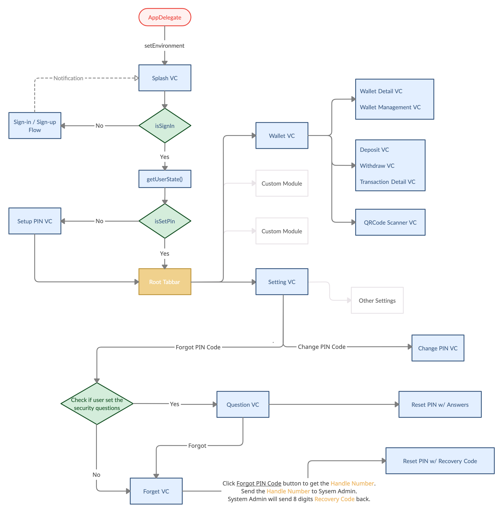
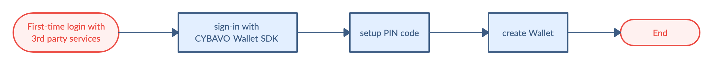
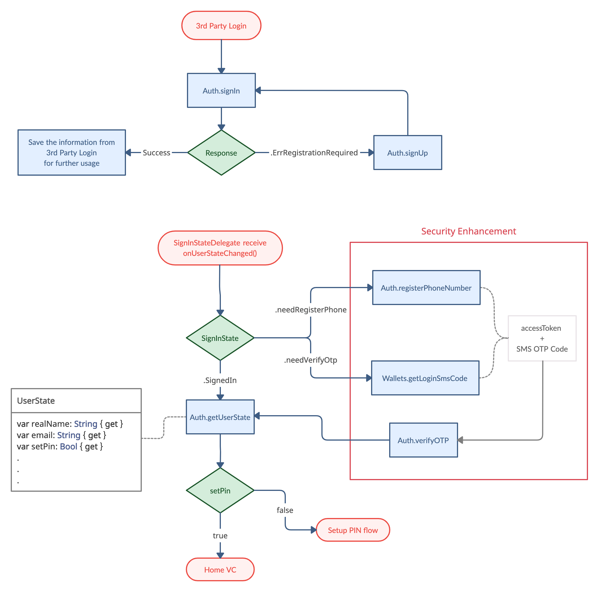
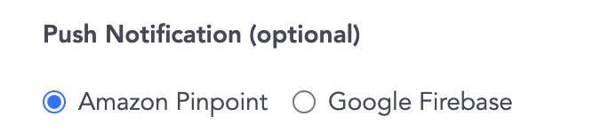

# CYBAVO Wallet APP SDK (for iOS) - Guideline

> Welcome to CYBAVO Wallet APP SDK (for iOS) - Guideline

The **CYBAVO Wallet APP SDK** provides a thorough solution for building Institutional-grade security wallets.  
It provides both high-level and low-level APIs for nearly all **CYBAVO Wallet APP** features, backed by **CYBAVO** private key protection technology.

- Category
  - [SDK Guideline](#sdk-guideline)
  - [Auth](#auth)
  - [PIN Code](#pin-code)
  - Wallets ➜ [wallets.md](wallets.md)
  - Transaction ➜ [transaction.md](transaction.md)
  - Security Enhancement ➜ [bio_n_sms.md](bio_n_sms.md)
  - [Push Notification](#push-notification)
  - [Others](#others)
  - Advanced
    - NFT ➜ [NFT.md](NFT.md)
    - WalletConnect ➜ [wallet_connect.md](wallet_connect.md)
    - CYBAVO Private Chain ➜ [private_chain.md](private_chain.md)
    - KYC with Sumsub ➜ [kyc_sumsub.md](kyc_sumsub.md)

## SDK Guideline

### Prerequisite

Please contact **CYBAVO** to get your `endPoint` and `apiCode`.

### Installation

- CocoaPods `1.9.3+` is required to build `CYBAVOWallet 1.2.451+`  
- Suggest using Xcode 14
- specify in your `Podfile`:

    ```sh
    source 'https://github.com/CocoaPods/Specs.git'
    source 'https://bitbucket.org/cybavo/Specs_512.git'

    platform :ios, '14.0'
    use_frameworks!

    target '<Your Target Name>' do
        pod 'CYBAVOWallet', '~> 1.2.451'
    end
  ```

- ⚠️ From `CYBAVOWallet 1.2.497`, please put following `post_install` hook in the Podfile.

  ```sh
  post_install do |installer|
    installer.pods_project.targets.each do |target|
      target.build_configurations.each do |config|
        config.build_settings['BUILD_LIBRARY_FOR_DISTRIBUTION'] = 'YES'
      end
    end
  end
  ```
  
- Then, run the following command:  

    ```shell
    pod install
    ```
### Setup

- Add the following code in your `AppDelegate.swift`, or your WalletSDK Manager.

  ```swift
  WalletSdk.shared.endPoint = <Your endpoint url>
  WalletSdk.shared.apiCode = <Your API code>
  ```

- See this : [Sandbox Environment](#sandbox-environment)

### APP Flowchart



### First-time login tasks



[↑ go to the top ↑](#cybavo-wallet-app-sdk-for-ios---guideline)

---

# Auth

## Sign-in / Sign-up Flowchart



## Third-Party Login

  Supported services : Apple / Google / Facebook / LINE / Twitter / WeChat

## Sign-in Flow

- 3rd party login ➡️ `Auth.signIn` ➡️ get success ➡️ wait for `SignInStateDelegate` update
  
- 3rd party login ➡️ `Auth.signIn` ➡️ get `.ErrRegistrationRequired` ➡️ Sign-up flow

```swift
/// sign-in with CYBAVOWallet Auth
///
/// - Parameters:
///   - token: Token String from different 3rd party SDK
///     1. Apple - authorization.credential.identityToken
///     2. Google - user.authentication.idToken
///     3. Facebook - AccessToken.current.tokenString
///     4. LINE - LoginResult.accessToken.value
///     5. Twitter - identity token
///     6. WeChat - identity token
///
///   - identityProvider: String of provider
///     1. Apple - "Apple"
///     2. Google - "Google"
///     3. Facebook - "Facebook"
///     4. LINE - "LINE"
///     5. Twitter - "Twitter"
///     6. WeChat - "WeChat"
///
///   - extras: Extra attributes for specific provider, pass null if unspecified.
///     1. id_token_secret (String) - Secret for Twitter
///
///   - completion: Result<_, ApiError>
///     case success: ➡️ Ready to getUserState()
///     case failure: if ErrorCode == .ErrRegistrationRequired ➡️ go to the Sign-up flow
///
public func signIn(token: String, identityProvider: String, extras: [String : String] = [:], completion: @escaping CYBAVOWallet.Callback<CYBAVOWallet.SignInResult>)
```

## Sign-up Flow

- `Auth.signUp` ➡️ get success ➡️ `Auth.signIn`

```swift
/// sign-up with CYBAVOWallet Auth
/// - Parameters:
///   - token: Refer to func signIn()
///   - identityProvider: Refer to func signIn()
///   - extras: Extra attributes for specific provider, pass null if unspecified.
///     1. id_token_secret (String) - Secret for Twitter
///     2. user_name (String) - User name, required for Apple auth
///
///   - completion: Result<_, ApiError>
///   case success: ➡️ Ready to signIn()
///   case failure: Handle ApiError
///
public func signUp(token: String, identityProvider: String, extras: [String : String] = [:], completion: @escaping CYBAVOWallet.Callback<CYBAVOWallet.SignUpResult>)
```
## Sign-out

```swift
public func signOut()
```

## Model : SignInState

```swift
public enum SignInState {

    case SignedIn // User signed in

    case SignedOut // User signed out

    case needVerifyOtp // User has signed in but need verify otp(sms code)

    case needRegisterPhone // User has signed in but need register phone

    ...
}
```

- monitor `SignInState`

  1. Call `addSignInStateDelegate()` in your auth manager.
  2. Conform `SignInStateDelegate` to handle `onUserStateChanged()` callback.  
  ⚠️ Remember to call `getSignInState()` when you get ready to receive `onUserStateChanged`, because iOS WalletSDK will only trigger delegate's `onUserStateChanged()` after `getSignInState()` has been called.
  3. Call `removeSignInStateDelegate()` if you don’t need monitor anymore.

  ```swift
  public func addSignInStateDelegate(_delegate: CYBAVOWallet.SignInStateDelegate)

  public func removeSignInStateDelegate(_ delegate: CYBAVOWallet.SignInStateDelegate)

  public protocol SignInStateDelegate : AnyObject {
      func onUserStateChanged(state: CYBAVOWallet.SignInState)
  }
  ```
- For Security Enhancement in the [flowchart](#sign-in--sign-up-flowchart), `.needVerifyOtp` and `.needRegisterPhone` SignInState, please see [Security Enhancement](bio_n_sms.md).

- Call `getSignInState()` whenever you need current `CYBAVOWallet.SignInState`.

  ```swift
  public func getSignInState() -> CYBAVOWallet.SignInState
  ```

## Model : UserState

```swift
public protocol UserState {

    var realName: String { get } /* Real name of user */

    var email: String { get } /* Email of user */

    var setPin: Bool { get } /* User has finished PIN setup */

    var setSecurityQuestions: Bool { get } /* User has setup BackupChallenges */

    ...
}
```

- Once you signed in, you should get the current `UserState` to check the variable `setPin`.

  `if (setPin == false)` ➡️ go to **_Setup PIN Code_** in the next section

- Call `Auth.getUserState` to get the current `UserState`

  ```swift
  public func getUserState(completion: @escaping CYBAVOWallet.Callback<CYBAVOWallet.GetUserStateResult>)
  ```

## Account deletion
For account deletion, Wallet SDK provides `revokeUser()` API and the detailed flow is described as below.
1. Check `UserState.setPin` 

    - If it's true, ask user to input PIN and call `revokeUser(pinSecret: PinSecret, completion: callback)`.
    - If it's false, just call `revokeUser(completion: callback)`.

2. (Suggest) Lead user back to sign in page without calling `signOut()` and sign out 3rd party SSO.  
⚠️ After `revokeUser()`, `signOut()` will trigger `onUserStateChanged` with state `.SessionExpired`.  

3. On the admin panel, the user will be mark as disabled with extra info: unregistered by user, then the administrator can remove PII (real name, email and phone) of the user.  

4. This account still can be enabled by administrator if needed. Before being enabled, if the user trying to sign in with revoked account, `signIn()` API will return `.ErrUserRevoked` error.  

[↑ go to the top ↑](#cybavo-wallet-app-sdk-for-ios---guideline)

---

# PIN Code

PIN Code is one of the most important components for user security.  
Ensure your users setPIN right after sign-in success.

## NumericPinCodeInputView

- Use `NumericPinCodeInputView` to input PIN code, see [this](NumericPinCodeInputView.md)
- feel free to customize your own input view.

## Setup PIN Code / Change PIN Code

- Setup PIN code is mandatory for further API calls. Make sure your user setup PIN code successfully before creating wallets.

``` swift
/// setup PIN code
/// - Parameters:
///   - pinSecret: PIN secret retrieved via PinCodeInputView
///   - completion: asynchronous callback
public func setupPinCode(pinSecret: CYBAVOWallet.PinSecret, completion: @escaping CYBAVOWallet.Callback<CYBAVOWallet.SetupPinCodeResult>)

public func changePinCode(newPinSecret: CYBAVOWallet.PinSecret, currentPinSecret: CYBAVOWallet.PinSecret, completion: @escaping CYBAVOWallet.Callback<CYBAVOWallet.ChangePinCodeResult>)
```

## Reset PIN code - with Security Question
- There are 2 ways to reset PIN code, one is by answering security questions

  1. Before that, the user has to set the answers of security questions.  
  ⚠️ Please note that the account must have at least a wallet, otherwise, the API will return `.ErrNoWalletToBackup` error.
  ```swift
  public func setupBackupChallenge(pinSecret: CYBAVOWallet.PinSecret, challenge1: CYBAVOWallet.BackupChallenge, challenge2: CYBAVOWallet.BackupChallenge, challenge3: CYBAVOWallet.BackupChallenge, completion: @escaping CYBAVOWallet.Callback<CYBAVOWallet.SetupPinCodeResult>)
  ```
  2. Get the security question for user to answer
  ```swift
  public func getRestoreQuestions(completion: @escaping CYBAVOWallet.Callback<CYBAVOWallet.GetRestoreQuestionsResult>)
  ```
  3. Verify user input answer (just check if the answers are correct)
  ```swift
  public func verifyRestoreQuestions(challenge1: CYBAVOWallet.BackupChallenge, challenge2: CYBAVOWallet.BackupChallenge, challenge3: CYBAVOWallet.BackupChallenge, completion: @escaping CYBAVOWallet.Callback<CYBAVOWallet.VerifyRestoreQuestionsResult>)
  ```
  4. Reset PIN code by security questions and answers
  ```swift
  public func restorePinCode(pinSecret: CYBAVOWallet.PinSecret, challenge1: CYBAVOWallet.BackupChallenge, challenge2: CYBAVOWallet.BackupChallenge, challenge3: CYBAVOWallet.BackupChallenge, completion: @escaping CYBAVOWallet.Callback<CYBAVOWallet.ChangePinCodeResult>)
  ```

## Reset PIN code - with Admin System

- If the user forgot both the PIN code and the answers which they have set.

  1. First, call API `forgotPinCode` to get the **_Handle Number_**.
  ```swift
  public func forgotPinCode(completion: @escaping Callback<ForgotPinCodeResult>)
  ```

  2. Second, contact the system administrator and get an 8 digits **_Recovery Code_**.
  3. Verify the recovery code  (just check if the recovery code is correct)
  ```swift
  public func verifyRecoveryCode(recoveryCode: String, completion: @escaping Callback<VerifyRecoveryCodeResult>)
  ```
  4. Reset PIN code by the recovery code.

  ```swift
  public func recoverPinCode(pinSecret: PinSecret, recoveryCode: String, completion: @escaping Callback<RecoveryPinCodeResult>)
  ```

## Notice

- Old version `pinCode: String` was deprecated, use `CYBAVOWallet.PinSecret` instead.

  `CYBAVOWallet.PinSecret` advantages:
    1. Much more secure
    2. Compatible with NumericPinCodeInputView
    3. Certainly release the PIN code with API  

- `PinSecret` will be cleared after Wallet and Auth APIs are executed. If you intendly want to keep the `PinSecret`, call `PinSecret.retain()` everytime before APIs are called.

> **⚠️ WARNING** : When creating multiple wallets for the user. If you call APIs constantly.  
> You will receive the error `.ErrInvalidPinSecret` caused by `PinSecret` being cleared.

[↑ go to the top ↑](#cybavo-wallet-app-sdk-for-ios---guideline)

---

# Push Notification

> Wallet SDK support 2 ways to integrate Push Notification: **Amazon Pinpoint** and **Google Firebase**

    

## Install and configuration

- For admin panel configuration, please refer to "Amazon Pinpoint / Google Firebase" section in CYBAVO Wallet SDK Admin Panel User Manual.
- Registering Your App with APNs, refer [this](https://developer.apple.com/documentation/usernotifications/registering_your_app_with_apns)
- Amazon Pinpoint：could also refer [this](https://github.com/CYBAVO/ios_wallet_sdk_sample/blob/master/docs/PushNotification.md)

## Setup

- Step 1 : decide your `pushDeviceToken` string
  - Amazon Pinpoint

    ```swift
    extension AppDelegate: UNUserNotificationCenterDelegate {
      
      func application(_ application: UIApplication, didRegisterForRemoteNotificationsWithDeviceToken deviceToken: Data) {
          let tokenParts = deviceToken.map { data in String(format: "%02.2hhx", data) }
          let token = tokenParts.joined()
          debugPrint("Device APNs Push Token: \(token)")
          
          UserManager.shared.pushDeviceToken = token
      }

      ...
    }
    ```

  - Google Firebase

    ```swift
    Messaging.messaging().delegate = self

    extension AppDelegate: MessagingDelegate {
    
        func messaging(_ messaging: Messaging, didReceiveRegistrationToken fcmToken: String?) {
            debugPrint("Device FCM Token: \(String(describing: fcmToken))")
            
            UserManager.shared.pushDeviceToken = fcmToken
        }
    }
    ```

- Step 2 : enable the WalletSdk apnsSandbox (for Dev environment)

  ```swift
  #if DEBUG
  WalletSdk.shared.apnsSandbox = true
  #endif
  ```

- Step 3 : After signed in, `setPushDeviceToken`
  
  ```swift
  /// Set Firebase Cloud Messaging (FCM) or Amazon Pinpoint device token
  /// - Parameters:
  ///   - deviceToken: The device token retrieved from FCM SDK or AWS SDK
  ///   - completion: asynchronous callback
  public func setPushDeviceToken(deviceToken: String, completion: @escaping CYBAVOWallet.Callback<CYBAVOWallet.SetPushDeviceTokenResult>)
  ```

  ```swift
  // After user Signed In
  guard Auth.shared.getSignInState() == .SignedIn else { return }

  // Set the push device token
  Auth.shared.setPushDeviceToken(deviceToken: pushDeviceToken) {
      ...
  }
  ```

- Step 4 : Receive and handle the notification

  ```swift
  func application(_ application: UIApplication, didReceiveRemoteNotification userInfo: [AnyHashable: Any], fetchCompletionHandler completionHandler: @escaping (UIBackgroundFetchResult) -> Void) {

      // Demo for 'Transaction' type

      let amount = userInfo["amount"] as? String ?? ""
      let from = userInfo["from_address"] as? String ?? ""
      let to = userInfo["to_address"] as? String ?? ""
      let out = userInfo["out"] as? String ?? ""
      let content = UNMutableNotificationContent()
      
      if (out == "true") {
          content.title = "Transaction Send"
          content.body = "Amount \(amount) from \(from)"
      } else {
          content.title = "Transaction Received"
          content.body = "Amount \(amount) to \(to)"
      }
      content.badge = 1
      content.sound = UNNotificationSound.default
      
      print("didReceiveRemoteNotification \(content.title)_\(content.body)")
      
      let trigger = UNTimeIntervalNotificationTrigger(timeInterval: 0.1, repeats: false)
      let request = UNNotificationRequest(identifier: UUID().uuidString, content: content, trigger: trigger)
      UNUserNotificationCenter.current().add(request, withCompletionHandler: nil)
      
      completionHandler(.newData)
  }
  ```

## Notification Types

There are 2 types of push notification: **Transacion** and **Announcement**.

1. Transaction
  
    ```swift
    {
        "currency": "194",
        "token_address": "",
        "timestamp": "1590376175",
        "fee": "",
        "from_address": "eeeeeeeee111",
        "amount": "0.0010",
        "wallet_id": "2795810471",
        "abi_method": "",
        "to_address": "eeeeeeeee111",
        "type": "1", // 1 means type Transaction
        "txid": "c90e839583f0fda14a1e055065f130883e5d2c597907de223f355b115b410da4",
        "out": "true", // true is Withdraw, false is Deposit
        "description": "d", 
        "abi_arguments": ""
    }
    ```

    - The keys of **Transaction** type are listed below
      Key    | Description  | Type  
      :------------|:------------|:-------
      type    | notification type    |  String
      wallet_id    | Wallet ID    |  String
      currency    | Currency     |  String
      token_address  | Token address | String
      out  | Transaction direction<br>("true": out, "false": in)| String
      amount  | Transaction amount | String
      fee  | Transaction fee | String
      from_address  | Transaction from address | String
      to_address  | Transaction to address | String
      timestamp  | Transaction timestamp | String
      txid  | Transaction TXID | String
      description  | Transaction description | String

    - Sample :

      - Withdraw (currencySymbol was from API getWallets)

        ```String
        Transaction Sent: Amount {{amount}} {{currencySymbol}} to {{fromAddress}}
        ```

      - Deposit (NFT wallet, i.e. wallet mapping to a Currency which tokenVersion is 721 or 1155)

        ```string
        Transaction Received: Token {{amount}}({{currencySymbol}}) received from {{fromAddress}}
        ```

2. Announcement

    ```JSON
    {
        "body": "All CYBAVO Wallet users will be charged 0.1% platform fee for BTC transaction during withdraw since 2021/9/10",
        "sound": "default",
        "title": "Important information",
        "category": "myCategory"
    }
    ```

[↑ go to the top ↑](#cybavo-wallet-app-sdk-for-ios---guideline)

---

# Others

## Error Handling - ApiError

> **⚠️ WARNING** : Please properly handle the ApiError we provided in the API response.

```swift
public struct ApiError : Error {

    public enum ErrorCode : Int { … } // Some error codes we defined.
    
    public let code: CYBAVOWallet.ApiError.ErrorCode

    public let message: String

    public let detailMessage: String // // The detailed error message.

    public var name: String { get }

    public init(code: CYBAVOWallet.ApiError.ErrorCode, message: String, detailMessage: String = "")
}
```
 Usage
```swift
Auth.shared.signIn(token: identity.idToken, identityProvider: identity.provider) { result in
            switch result {
            case .success(_):
                break
            case .failure(let error):
                if error.code == .ErrRegistrationRequired {
                    // registration required
                    self.doSignUp(identity: identity)
                }
                self.showSignIn()
                break
            }
        }
```
### Error Code
Please refer to enumeration `ApiError.ErrorCode` for error code.

| Case  | Raw Value | Description |
| ----  | ----  | ---- |
|	ErrUnknown	|	-1	|	Unknown error	|
|	ErrNotSignedIn	|	-2	|	Not signed in	|
|	ErrInvalidPinCode	|	-3	|	Invalid PIN code	|
|	ErrConcurrentExecution	|	-4	|	Concurrent execution	|
|	ErrInvalidPinSecret	|	-5	|	PIN secret not valid	|
|	ErrBiometricUnsupported	|	-6	|	Biometric Unsupported	|
|	ErrUserCancel	|	-7	|	User cancel operation	|
|	ErrDisableAdmin	|	101	|	Admin cannot disable	|
|	ErrUserOrPasswordIncorrect	|	102	|	The Email address or password provided is not correct	|
|	ErrUserExist	|	103	|	Account already exists	|
|	ErrUserDisabled	|	104	|	Account was banned by admin	|
|	ErrUserEmailEmpty	|	105	|	Email cannot be empty	|
|	ErrUserEmailExist	|	106	|	Email has been used	|
|	ErrUserEmailFormatError	|	107	|	Email format is incorrect	|
|	ErrUserPasswordFormatError	|	108	|	Password should be 8-18 chars	|
|	ErrUserAccountFormatError	|	109	|	Account can only be english char and 3-50 chars	|
|	ErrUserRoleError	|	110	|	Permission is incorrect	|
|	ErrorUserPasswordError	|	111	|	Old password is incorrect	|
|	ErrInvalidParameter	|	112	|	Invalid parameter	|
|	ErrPermissionDenied	|	113	|	Permission denied	|
|	ErrNotAuthByPIN	|	114	|	Need user setup PIN before do this	|
|	ErrNotAuthByOTP	|	115	|	Need user bind OTP before do this	|
|	ErrUserInvalidPasswordToken	|	116	|	Token is Invalid	|
|	ErrUserReject	|	117	|	Reject by User	|
|	ErrNotImplemented	|	118	|	Not Implemented	|
|	ErrEncryptFailed	|	119	|	Error Encrypt failed	|
|	ErrUserAuthMethodInvalid	|	120	|	Not support this kind of authorization	|
|	ErrUserUnactivated	|	125	|	Unactivated user	|
|	ErrUserInvalid	|	126	|	invalid user	|
|	ErrUserAlreadyActivated	|	127	|	User already activated	|
|	ErrUserRequireOTPSetup	|	128	|	Need to setup OTP for auth before operation this action	|
|	ErrOnlyAdminCanBeAdded	|	129	|	Only admin can be added from web	|
|	ErrUserGetInfoFailed	|	130	|	Get user info failed	|
|	ErrUserNoPIN	|	131	|	User does not set pin yet	|
|	ErrAddUserDuplicate	|	132	|	User already exist	|
|	ErrAddUserFailed	|	133	|	Add User failed	|
|	ErrUserUnauthorized	|	134	|	User unauthorized	|
|	ErrUserIncorrectPIN	|	135	|	Incorrect user PIN	|
|	ErrClientVersion	|	136	|	Unknown client version	|
|	ErrAppMustUpdate	|	137	|	Please update you CYBAVO Vault to access to the latest features!	|
|	ErrInvalidDeviceToken	|	138	|	Invalid device token	|
|	ErrUserIncorrectPINMaxRetry	|	139	|	Incorrect user PIN. Retry limit exceeded	|
|	ErrShutdownInProgress	|	140	|	Shutdown in progress	|
|	ErrUserDeactivated	|	141	|	User has been deactivated	|
|	ErrUserNameEmpty	|	142	|	User name is empty	|
|	ErrMappedWallet	|	143	|	Create mapped wallet fail	|
|	ErrNotTokenWallet	|	144	|	Only Token can create mapped wallet	|
|	ErrNotCreateMultiMappedToSameAddr	|	145	|	Cannot create 2 mapped wallet to 1 wallet address	|
|	ErrMappedWalletOnly	|	146	|	Only Mapped Wallet can use Mapped ID	|
|	ErrConnectCCServer	|	147	|	Failed to connect CC server	|
|	ErrUserIsLocked	|	148	|	User is locked	|
|	ErrUnlockCodeExpired	|	149	|	Unlock link expired	|
|	ErrOperationTooFrequent	|	150	|	Operation too frequent	|
|	ErrUpdateKeyInProgress	|	151	|	Update key in progress	|
|	ErrInvalidQRCode	|	152	|	Invalid QR Code	|
|	ErrForgotPINNotReady	|	153	|	Not able to restore PIN yet. Please contact admin to initial this process	|
|	ErrInvalidRestoreCode	|	154	|	Invalid restore code	|
|	ErrNoRecoveryCode	|	155	|	No wallet recovery data for user	|
|	ErrRegisterFail	|	156	|	Register fail	|
|	ErrRegistrationRequired	|	157	|	Registration required	|
|	ErrDisableSelf	|	158	|	Unable to disable yourself	|
|	ErrForgotPINInvalid	|	159	|	User did not request to recovery PIN	|
|	ErrForgotPINExpired	|	160	|	Forgot PIN expired. Please ask user to submit again	|
|	ErrUnableChangeRole	|	161	|	Unable to change role	|
|	ErrForgotPINHandled	|	162	|	Already handle by other admin	|
|	ErrForgotPINNotApprove	|	163	|	Not approve by admin	|
|	ErrAdminInfoNotFound	|	164	|	Admin info not found	|
|	ErrInvalidAdminPerm	|	165	|	User permission was changed by others	|
|	ErrUserIncorrectPINLock	|	166	|	The account is temporarily blocked because you entered the wrong PIN too many times	|
|	ErrUserIsUnlocked	|	167	|	User was unlocked	|
|	ErrUserIncorrectSQLock	|	168	|	The account is temporarily blocked because you entered the wrong answer too many times	|
|	ErrUserPINAlreadySet	|	169	|	User already set PIN	|
|	ErrUserSecureTokenNotReady	|	170	|	Secure token not ready	|
|	ErrUserSecurityQuestionsNotReady	|	171	|	User has not setup security questions yet	|
|	ErrInvalidUnlockToken	|	172	|	Invalid Unlock token	|
|	ErrInvalidHashLength	|	173	|	Hash is required to be exactly 32 bytes	|
|	ErrInvalidAbiFunction	|	174	|	Invalid ABI function	|
|	ErrOperationTooFrequentShortly	|	175	|	Frequent operation, please try again after 1 sec	|
|	ErrUserPhoneNumUnverified	|	180	|	User phone number not verified, need register phone number	|
|	ErrActionTokenInvalid	|	181	|	Action token invalid	|
|	ErrOTPCodeInvalid	|	182	|	OTP code(SMS code) invalid	|
|	ErrRequireTooFrequent	|	183	|	Require too frequent	|
|	ErrInvalidSignature	|	184	|	Invalid Signature	|
|	ErrBiometricsNotFound	|	185	|	Biometrics setting not found, need updateDeviceInfo	|
|	ErrDeviceOtpUnverified	|	186	|	Device otp(SMS code) unverified, need getLoginSms then verifyOtp	|
|	ErrOverSMSLimit	|	187	|	Exceed daily SMS limit	|
|	ErrUserSkipSMSVerify	|	188	|	Skip user SMS/Biometrics verify	|
|	ErrUserSMSVerifed	|	189	|	User phone has been verified	|
|	ErrUserReferralAlreadySet	|	190	|	User referral code has been set	|
|	ErrUserReferralNotSetSelf	|	191	|	User referral code can not be yourself	|
|	ErrReferralUserIdGreaterThenSelf	|	192	|	Referral user should register earlier then yourself	|
|	ErrDepartmentInvalid	|	193	|	Invalid department	|
|	ErrDepartmentTransactionNotFound	|	194	|	Cannot find any transaction in this department	|
|	ErrKeywordForSearchTooShort	|	195	|	The keyword for search user is too short	|
|	ErrInputStringTooLong	|	196	|	The input string is too long	|
|	ErrUserRevoked	|	197	|	Account is revoked	|
|	ErrWalletCreateFailed	|	301	|	Wallet Create Failed	|
|	ErrWalletAddressInvalid	|	302	|	Invalid Address, please make sure your address format is correct	|
|	ErrWalletCurrencyInvalid	|	303	|	Invalid currency	|
|	ErrWalletIDInvalid	|	304	|	Wallet ID invalid	|
|	ErrWalletPolicyParseFailed	|	305	|	Parse SetWalletPolicyRequest failed	|
|	ErrWalletPolicySetFailed	|	306	|	Set SetWalletPolicyRequest failed	|
|	ErrWalletPolicyGetFailed	|	307	|	Get SetWalletPolicyRequest failed	|
|	ErrPolicySignFail	|	308	|	Policy Sign fail	|
|	ErrPolicySignInvalid	|	309	|	Policy Sign invalid	|
|	ErrPolicyState	|	310	|	Policy state error	|
|	ErrPolicyTransFail	|	311	|	Policy transfer fail	|
|	ErrPolicyNotFound	|	312	|	Policy not found	|
|	ErrPolicyNotPass	|	313	|	Not pass policy enforcement	|
|	ErrPolicyApprover	|	314	|	Invalid policy approver	|
|	ErrPolicyWalletNotFound	|	315	|	Policy: wallet not found	|
|	ErrPolicyCurrencyNotMatch	|	316	|	Policy: currency not match	|
|	ErrPolicyCurrencyNotSupport	|	317	|	Policy: currency not support	|
|	ErrPolicyNotWalletCreator	|	318	|	Policy: not wallet creator	|
|	ErrPolicyWalletAddressDiff	|	319	|	Policy: wallet address is incorrect	|
|	ErrPolicyWalletHeaderTrans	|	320	|	Policy: the transaction count of wallet should be greater than zero	|
|	ErrPolicyAmountTransferFail	|	321	|	Policy: amount trans to value fail	|
|	ErrPolicyWalletHeaderAmount	|	322	|	Policy: the transaction amount of wallet should greater than zero	|
|	ErrPolicyOutgoingAddressNull	|	323	|	Policy: no outgoing address	|
|	ErrPolicyOutgoingAddressQFail	|	324	|	Policy: outgoing address incorrect	|
|	ErrPolicyOutgoingAddressInconsistent	|	325	|	Policy: outgoing address inconsistent	|
|	ErrPolicyAuditorDuplicateOrder	|	326	|	Policy: auditor duplicate order	|
|	ErrPolicyAuditorDuplicateUser	|	327	|	Policy: auditor duplicated user	|
|	ErrPolicyApproverDuplicateOrder	|	328	|	Policy: approver duplicate order	|
|	ErrPolicyApproverDuplicateUser	|	329	|	Policy: approver duplicate user	|
|	ErrPolicyOperatorDuplicateOrder	|	330	|	Policy: operator duplicate order	|
|	ErrPolicyOperatorDuplicateUser	|	331	|	Policy: operator duplicate user	|
|	ErrPolicyOperatorAmountTransFail	|	332	|	Policy: operator amount trans fail	|
|	ErrPolicyOperatorAmountUnderZero	|	333	|	Policy: the amount of operator should be greater than zero	|
|	ErrPolicyOperatorTransUnderZero	|	334	|	Policy: the transaction count of operator should be greater than zero	|
|	ErrPolicyOperatorAmountOverMax	|	335	|	Policy: the amount of wallet should be greater than the amount of operator	|
|	ErrPolicyOperatorTransOverMax	|	336	|	Policy: the transaction count of wallet should be greater than the transaction count of operator	|
|	ErrPolicyApproverAmountTransFail	|	337	|	Policy: approver amount trans fail	|
|	ErrPolicyApproverAmountUnderZero	|	338	|	Policy: the amount of approver should be greater than zero	|
|	ErrPolicyMaxAppOverMaxOp	|	339	|	Policy: the maximum operator amount should be greater than the minimum approver amount	|
|	ErrPolicyNoOperator	|	340	|	Policy: No operator	|
|	ErrPolicyPINNotSet	|	341	|	Policy: some user has not set pin	|
|	ErrPolicyUserNotExist	|	342	|	Policy: some user not exist	|
|	ErrPolicyApproverNotCosigner	|	343	|	Policy: approver is not cosigner	|
|	ErrPolicyAllCosignersNotApprover	|	344	|	Policy: cosigners not approvers	|
|	ErrPolicyApproverConfigureIncorrectly	|	345	|	Policy: approver configure incorrectly	|
|	ErrPolicyLevelIncorrect	|	346	|	Policy: level incorrect	|
|	ErrPolicyOwnerIncorrect	|	347	|	Policy: Owner count incorrect	|
|	ErrWalletNotOperation	|	348	|	Not wallet operator	|
|	ErrScheduleWithdrawNotFound	|	349	|	Invalid schedule withdraw	|
|	ErrScheduleWithdrawNotCreator	|	350	|	Permission denied. Only creator can delete schedule withdraw	|
|	ErrNoWalletToBackup	|	351	|	No wallet to backup	|
|	ErrInvalidBackupAnswer	|	352	|	Invalid backup answer	|
|	ErrWalletMnemonicDuplicate	|	353	|	Another activated user with same mnemonic	|
|	ErrScheduleWithdrawExceedPolicyAmount	|	354	|	Exceed Operator Allow Amount	|
|	ErrScheduleWithdrawNotOperator	|	355	|	Not Operator in WalletPolicy	|
|	ErrScheduleWithdrawNotOutgoing	|	356	|	Not Outgoing in WalletPolicy	|
|	ErrScheduleWithdrawCheckBalanceFailed	|	357	|	Check balance failed	|
|	ErrScheduleWithdrawInvalid	|	358	|	Schedule withdraw invalid	|
|	ErrGetTransactionFeeError	|	359	|	Fail to get transaction fee	|
|	ErrNotPendingNow	|	360	|	Policy changed, unlock again if needed	|
|	ErrInvalidFeeLevel	|	361	|	Invalid fee level	|
|	ErrSignBatchTransactionFailed	|	362	|	Fail to sign batch transaction	|
|	ErrWalletKeyNotReady	|	363	|	Wallet not ready to withdraw	|
|	ErrNotBatchWallet	|	364	|	Not batch wallet	|
|	ErrNotBatchTransaction	|	365	|	Not batch transaction	|
|	ErrExceedMaxBatchAmount	|	366	|	Exceed max batch amount	|
|	ErrOngoingBatchTransaction	|	367	|	Doing batch transaction	|
|	ErrTxIDNotFound	|	368	|	Transaction id not found	|
|	ErrNotWalletOwner	|	369	|	Not wallet owner	|
|	ErrNotAdmin	|	370	|	Not Admin	|
|	ErrInvalidWalletId	|	371	|	Invalid wallet	|
|	ErrWalletAlreadyCreated	|	372	|	Wallet already created	|
|	ErrTransactionSameAddress	|	373	|	Cannot send amount to yourself address	|
|	ErrDestinationNotInOutgoingAddress	|	374	|	Destination address must in outgoing address	|
|	ErrApiSecretExpired	|	384	|	API Secret expired	|
|	ErrAPISecretNotValid	|	385	|	API Secret not valid	|
|	ErrExpiredTx	|	386	|	Transaction is expired	|
|	ErrCPUUsageExceeded	|	387	|	CPU usage exceeded, please delegate CPU for usage	|
|	ErrNetUsageExceeded	|	388	|	NET usage exceeded, please delegate NET for usage	|
|	ErrRAMUsageExceeded	|	389	|	RAM usage exceeded, please purchase RAM for usage	|
|	ErrorInsufficientStakedCPU	|	390	|	Insufficient staked CPU bandwidth, please delegate CPU for usage	|
|	ErrorInsufficientStakedNet	|	391	|	Insufficient staked NET bandwidth, please delegate NET for usage	|
|	ErrorInsufficientQuota	|	392	|	Insufficient RAM quota, please purchase RAM for usage	|
|	ErrTransactionNotReplaceable	|	393	|	Transaction is not replaceable	|
|	ErrBalanceUppoerTransFail	|	401	|	Balance: upper bound value transfer fail	|
|	ErrBalanceLowerTransFail	|	402	|	Balance: lower bound value transfer fail	|
|	ErrBalanceLOverU	|	403	|	Balance: lower bound >= upper bound	|
|	ErrBalanceIntervalIncorrect	|	404	|	Balance: Interval should between 1800 (30 minutes) ~ 86400 (1 day)	|
|	ErrBalanceDBNotFound	|	405	|	Balance: Not found item in DB	|
|	ErrBalanceItemNotMatch	|	406	|	Balance: Item not match	|
|	ErrBalanceIdInvalid	|	407	|	Invalid ID	|
|	ErrNoContractCode	|	408	|	No contract code at given address	|
|	ErrInvalidLedgerConfig	|	432	|	Invalid ledger server config	|
|	ErrExpiredToken	|	500	|	Expired Token	|
|	ErrVerifyFail	|	501	|	Verify fail, incorrect number	|
|	ErrVerifyExceed	|	502	|	Exceed maximum retry counts, please resend the verify number again	|
|	ErrParameterNoToken	|	701	|	No token present	|
|	ErrParameterInvalidOperation	|	702	|	Unknown operation	|
|	ErrOperationFailed	|	703	|	Operation failed	|
|	ErrSKUInfoFailed	|	704	|	Failed to get SKU info	|
|	ErrSKUUserLimit	|	705	|	Exceed max allow user limitation, Upgrade your SKU to get more users	|
|	ErrSKUWalletLimit	|	706	|	Exceed max allow wallet limitation, Upgrade your SKU to get more wallets	|
|	ErrSKUOutgoingLimit	|	707	|	Exceed max allow outgoing address limitation, Upgrade your SKU to get more outgoing address	|
|	ErrTransactionInsufficientFund	|	801	|	Insufficient fund	|
|	ErrTransactionUTXOInsufficientFund	|	802	|	UTXO Temporarily Not Available	|
|	ErrUTXOTemporarilyNotAvailable	|	803	|	Full nodes' syncing now, wait a few minutes to do the transaction	|
|	ErrFullNodeSyncing	|	804	|	Duplicate outgoing address	|
|	ErrOutgoingAddressDuplicate	|	901	|	Invalid outgoing address ID	|
|	ErrOutgoingAddressIdInvalid	|	902	|	Invalid outgoing address ID	|
|	ErrKMSNotReady	|	903	|	KMS out of service. Please try again later.	|
|	ErrInvalidApiCode	|	904	|	Invalid Api Code	|
|	ErrDuplicateApp	|	905	|	Duplicate entry	|
|	ErrSDKOutdated	|	906	|	WalletSDK is outdated. Please upgrade your SDK	|
|	ErrorFeeLowerBound	|	907	|	Inner Fee less than lower bound	|
|	ErrorFeeUpperBound	|	908	|	Inner Fee higher than upper bound	|
|	ErrorInnerFeeAmount	|	909	|	Inner fee configuration incorrect	|
|	ErrorTransferAmountFail	|	910	|	Inner fee transfer amount fail	|
|	ErrFailToGetFee	|	911	|	Inner fee fail to check fee	|
|	ErrFeeTooHigh	|	912	|	Inner fee higher than amount	|
|	ErrParseTransactionFail	|	913	|	Parse transaction fail	|
|	ErrNotSupportInnerFee	|	914	|	Batch transaction not support inner fee now, please contact CYBAVO for next step	|
|	ErrorFeeOverUpper	|	915	|	Transaction fee over upper bound	|
|	ErrorInnerFeeAddress	|	916	|	Inner Fee address incorrect	|
|	ErrNoTRONForEnergy	|	917	|	Need at least 1 TRX in wallet for energy usage.	|
|	ErrorInsufficientBandWidth	|	918	|	Insufficient bandwidth, need to delegate bandwidth or Tron	|
|	ErrorDestNotExist	|	919	|	Destination not create. Too little XRP(< 20) sent to create it	|
|	ErrTransactionInsufficientBTCFee	|	920	|	BTC is not enough to pay for transaction fee	|
|	ErrTransactionInsufficientETHFee	|	921	|	ETH is not enough to pay for transaction fee	|
|	ErrTransactionInsufficientBTCUTXOFee	|	922	|	BTC UTXOs is not enough to pay for transaction fee	|
|	ErrDustFail	|	923	|	Transfer amount is too small and considered as dust by blockchain	|
|	ErrUTXOExceedMax	|	924	|	The number of UTXO set exceed max allow number (2500)	|
|	ErrUTXONotEnough	|	925	|	BTC UTXOs are not enough to pay for platform fee	|
|	ErrInsufficientFundBNB	|	926	|	Insufficient fund, you must leave 0.000625 BNB for transaction fee	|
|	ErrorTxNoResult	|	927	|	No Result from BNB full node	|
|	ErrorSendTxFail	|	928	|	Send Tx to BNB full node fail	|
|	ErrorIllegalFormat	|	929	|	Illegal transaction format	|
|	ErrorAccountNotCreate	|	930	|	Account was not created, please send at least 1 TRX to this address for account creation	|
|	ErrorIncorrectTag	|	931	|	Destination Tag must be integer	|
|	ErrInvalidEOSFormat	|	932	|	Invalid EOS Account format	|
|	ErrInvalidAppId	|	933	|	Invalid App ID	|
|	ErrInvalidPinpointAppId	|	934	|	Invalid AWS Pinpoint App ID	|
|	ErrEOSAccountExisted	|	935	|	This EOS Account already existed	|
|	ErrReferralCodeIncorrect	|	936	|	User account not exist, referral code incorrect	|
|	ErrGoogleAuthError	|	1001	|	Google Auth erro	|
|	ErrWechatAuthError	|	1002	|	WeChat Auth error	|
|	ErrFacebookAuthError	|	1003	|	Facebook Auth error	|
|	ErrLineAuthError	|	1004	|	LINE Auth error	|
|	ErrInvalidPINToken	|	10001	|	PIN token expired, need to sign in again to recover	|
|	ErrorRamOperationMinAmount	|	10301	|	RAM operation bytes smaller than minimal amounts	|
|	ErrOutgoingAddressNotMatch	|	10302	|	Outgoing address is not matched with raw transaction	|
|	ErrWalletInnerFeeIncorrect	|	10303	|	Wallet inner fee calculate incorrectly	|
|	ErrWalletCreateInnerTxFail	|	10304	|	Create Tx with inner fee failed	|
|	ErrNoTranslation	|	10936	|	Translation not ready	|
|	ErrTransactionInsufficientLTCFee	|	10937	|	LTC is not enough to pay for transaction fee	|
|	ErrTransactionInsufficientLTCUTXOFee	|	10938	|	LTC UTXOs is not enough to pay for transaction fee	|
|	ErrTransactionInsufficientBCHFee	|	10939	|	BCH is not enough to pay for transaction fee	|
|	ErrTransactionInsufficientBCHUTXOFee	|	10940	|	BCH UTXOs is not enough to pay for transaction fee	|
|	ErrOverPersonalCurrencyLimit	|	10941	|	Over personal currency limit	|
|	ErrKycNotCreated	|	10942	|	Not createKyc before getApplicantStatus	|
|	ErrKycSettingsNotFound	|	10943	|	KYC setting not exist when getApplicantStatus	|
|	ErrSmartchainInvalidMemoFormat	|	12001	|	Invalid memo format, only allow numbers	|
|	ErrSmartchainInvalidAmountFormat	|	12002	|	Invalid amount format	|
|	ErrSmartchainBalanceCheckFailed	|	12003	|	Amount or balance format invalid	|
|	ErrSmartchainDepositMinCheckFailed	|	12004	|	Deposit amount smaller than the minimum limit	|
|	ErrSmartchainDepositMaxCheckFailed	|	12005	|	Deposit amount greater than the maximum limit	|
|	ErrSmartchainProductIsOutOfStock	|	12006	|	Smart chain product is out of stock	|
|	ErrSmartchainOperationFailed	|	12007	|	Smart chain operation failed	|
|	ErrSmartchainBalanceSmallerThanMinWithdraw	|	12008	|	Balance smaller than the minimum withdraw amount and the platform fee	|
|	ErrSmartchainCallAmountExceedsBalance	|	12101	|	Smart chain amount exceeds balance	|
|	ErrSmartchainCallAmountExceedsAllowance	|	12102	|	Smart chain amount exceeds allowance	|
|	ErrSmartchainCallZeroAddr	|	12103	|	Smart chain zero address	|
|	ErrSmartchainCallDepositStop	|	12104	|	Smart chain deposit should not stop	|
|	ErrSmartchainCallWithdrawStop	|	12105	|	Smart chain withdraw should not stop	|
|	ErrSmartchainCallRateLimit	|	12106	|	Smart chain rate limiting	|
|	ErrSmartchainCallWithdrawLimit	|	12107	|	Smart chain exceed withdraw limit	|
|	ErrSmartchainCallMaxUserLimit	|	12108	|	Smart chain exceed max user limit	|
|	ErrSmartchainCallMaxUserOrderLimit	|	12109	|	Smart chain exceed max user orders limit	|
|	ErrSmartchainCallMaxDepositAmountLimit	|	12110	|	Smart chain exceed max deposit amount limit	|
|	ErrSmartchainCallAmountNotMatch	|	12111	|	Smart chain amount not match	|
|	ErrSmartchainCallOrderNotExist	|	12112	|	Smart chain order not exist	|
|	ErrSmartchainCallOrderExist	|	12113	|	Smart chain order already exist	|
|	ErrSmartchainCallNoProfitSharing	|	12114	|	Smart chain no profit sharing	|
|	ErrSmartchainCallAmountSmallThenZero	|	12115	|	Smart chain amount should grater than 0	|
|	ErrSmartchainCallNotAllowWithdraw	|	12116	|	Smart chain payee is not allowed to withdraw	|
|	ErrSmartchainCallNotAllowEarlyWithdraw	|	12117	|	Smart chain should do withdraw directly	|
|	ErrSmartchainCallTransferSmallThenZero	|	12118	|	Smart chain transferAmount is smaller than zero	|

For error code -995 ~ -3007 please refer to iOS Fundation framwork's [URL Loading System Error Codes](https://developer.apple.com/documentation/foundation/1508628-url_loading_system_error_codes)  

| Case  | Raw Value | Description |
| ----  | ----  | ---- |
|	NSURLErrorBackgroundSessionRequiresSharedContainer	|	-995	|	The shared container identifier of the URL session configuration is needed but hasn’t been set	|
|	NSURLErrorBackgroundSessionInUseByAnotherProcess	|	-996	|	An app or app extension attempted to connect to a background session that is already connected to a process	|
|	NSURLErrorBackgroundSessionWasDisconnected	|	-997	|	The app is suspended or exits while a background data task is processing	|
|	NSURLErrorCancelled	|	-999	|	An asynchronous load has been canceled	|
|	NSURLErrorBadURL	|	-1000	|	A malformed URL prevented a URL request from being initiated	|
|	NSURLErrorCannotFindHost	|	-1003	|	The host name for a URL couldn’t be resolved	|
|	NSURLErrorCannotConnectToHost	|	-1004	|	An attempt to connect to a host failed	|
|	NSURLErrorNetworkConnectionLost	|	-1005	|	A client or server connection was severed in the middle of an in-progress load	|
|	NSURLErrorDNSLookupFailed	|	-1006	|	The host address couldn’t be found via DNS lookup	|
|	NSURLErrorHTTPTooManyRedirects	|	-1007	|	A redirect loop was detected or the threshold for number of allowable redirects was exceeded (currently 16)	|
|	NSURLErrorNotConnectedToInternet	|	-1009	|	A network resource was requested, but an internet connection has not been established and can’t be established automatically	|
|	NSURLErrorRedirectToNonExistentLocation	|	-1010	|	A redirect was specified by way of server response code, but the server didn’t accompany this code with a redirect URL	|
|	NSURLErrorBadServerResponse	|	-1011	|	The URL Loading System received bad data from the server	|
|	NSURLErrorCannotDecodeRawData	|	-1015	|	Content data received during a connection request couldn’t be decoded for a known content encoding	|
|	NSURLErrorCannotDecodeContentData	|	-1016	|	Content data received during a connection request had an unknown content encoding	|
|	NSURLErrorCannotParseResponse	|	-1017	|	A response to a connection request couldn’t be parsed	|
|	NSURLErrorInternationalRoamingOff	|	-1018	|	The attempted connection required activating a data context while roaming, but international roaming is disabled	|
|	NSURLErrorCallIsActive	|	-1019	|	A connection was attempted while a phone call was active on a network that doesn’t support simultaneous phone and data communication, such as EDGE or GPRS	|
|	NSURLErrorDataNotAllowed	|	-1020	|	The cellular network disallowed a connection	|
|	NSURLErrorRequestBodyStreamExhausted	|	-1021	|	A body stream was needed but the client did not provide one	|
|	NSURLErrorAppTransportSecurityRequiresSecureConnection	|	-1022	|	App Transport Security disallowed a connection because there is no secure network connection	|
|	NSURLErrorFileDoesNotExist	|	-1100	|	The specified file doesn’t exist	|
|	NSURLErrorFileIsDirectory	|	-1101	|	A request for an FTP file resulted in the server responding that the file is not a plain file, but a directory	|
|	NSURLErrorNoPermissionsToReadFile	|	-1102	|	A resource couldn’t be read because of insufficient permissions	|
|	NSURLErrorDataLengthExceedsMaximum	|	-1103	|	The length of the resource data exceeded the maximum allowed	|
|	NSURLErrorFileOutsideSafeArea	|	-1104	|	An internal file operation failed	|
|	NSURLErrorClientCertificateRejected	|	-1205	|	A server certificate was rejected	|
|	NSURLErrorClientCertificateRequired	|	-1206	|	A client certificate was required to authenticate an SSL connection during a connection request	|
|	NSURLErrorCannotLoadFromNetwork	|	-2000	|	A specific request to load an item only from the cache couldn't be satisfied	|
|	NSURLErrorCannotCreateFile	|	-3000	|	A download task couldn’t create the downloaded file on disk because of an I/O failure	|
|	NSURLErrorCannotOpenFile	|	-3001	|	A downloaded file on disk couldn’t be opened	|
|	NSURLErrorCannotCloseFile	|	-3002	|	A download task couldn’t close the downloaded file on disk	|
|	NSURLErrorCannotWriteToFile	|	-3003	|	A download task couldn’t write the file to disk	|
|	NSURLErrorCannotRemoveFile	|	-3004	|	A downloaded file couldn’t be removed from disk	|
|	NSURLErrorCannotMoveFile	|	-3005	|	A downloaded file on disk couldn’t be moved	|
|	NSURLErrorDownloadDecodingFailedMidStream	|	-3006	|	A download task failed to decode an encoded file during the download	|
|	NSURLErrorDownloadDecodingFailedToComplete	|	-3007	|	A download task failed to decode an encoded file after downloading	|

## Sandbox Environment

- You will only get the `endPoint` & `apiCode` for testing in the beginning.
- We will provide the production `endPoint` & `apiCode` when you are ready.
Feel free to play around with the WalletSDK in the sandbox environment.

[↑ go to the top ↑](#cybavo-wallet-app-sdk-for-ios---guideline)
