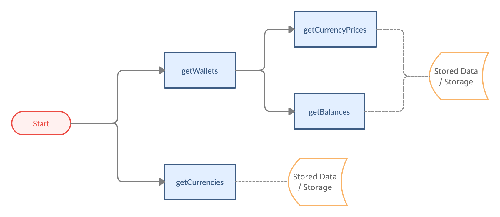
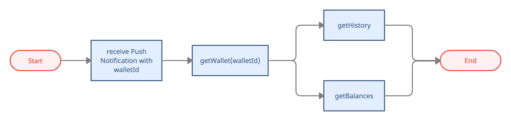

# Wallets

- Bookmarks
  - [Wallet Information](#wallet-information)
  - [Wallet Management](#wallet-management)
  - [Others](#others)

## Wallet Information



### getCurrencies

- Use case 1: when `getWallets`, filter supported currencies for display
- Use case 2: before `createWallet`, call `getCurrencies` + `getSameCurrencyWalletLimit` to decide whether the user can create a new wallet or not.
- For `Currency.currency`, please refer to [Currency Definition](https://github.com/CYBAVO/SOFA_MOCK_SERVER#currency-definition)

```swift
/// Get supported currency list
/// - Parameter completion: asynchronous callback
public func getCurrencies(completion: @escaping CYBAVOWallet.Callback<CYBAVOWallet.GetCurrenciesResult>)
```

### getWallets

```swift
/// Get wallet list of signed in user
/// - Parameter completion: asynchronous callback
public func getWallets(completion: @escaping CYBAVOWallet.Callback<CYBAVOWallet.GetWalletsResult>)
```

### getCurrencyPrices

```swift
/// Get Currency price
/// - Parameters:
///   - wallets: [CYBAVOWallet.Wallet]
///   - exchangeCurrencys: currencies which need to get price. ex usd, twd
///   - approximateRates: rate reference. When the price is 0, it can be calculated by other exchange currency's price multiply the rate. ex ["TWD", ["USD", 29.45]]
///   - completion: asynchronous callback
public func getCurrencyPrices(wallets: [CYBAVOWallet.Wallet], exchangeCurrencys: [String], approximateRates: [String : [String : Double]] = [:], completion: @escaping CYBAVOWallet.Callback<[String : Double]>)
```

### getBalances

```swift
/// Get number balances on a batch of addresses(recommend)
/// - Parameters:
///   - addresses: Dictionary of addresses to query. ex: [Wallet.walletId: Wallet]
///   - completion: Dictionary of Balances. ex: [Wallet.walletId: Balance]
public func getBalances(addresses: [Int64 : CYBAVOWallet.BalanceAddress], completion: @escaping CYBAVOWallet.Callback<CYBAVOWallet.GetBalanceResult>)
```

#### Model: `Balance`

```swift
protocol Balance {

    var balance: String { get } /** Balance */

    var tokenBalance: String { get } /** Balance of token */

    var availableBalance: String { get } /** Available balance */

    var tokens: [String] { get } /** Non-Fungible Token IDs for ERC-721*/

    var tokenIdAmounts: [CYBAVOWallet.TokenIdAmount] { get } /** Non-Fungible Token ID and amounts for ERC-1155 */

    ...
}
```

- `Balance` is for the parent wallet (`tokenAddress` is “”). ex: ETH wallet
- `tokenBalance` is for mapped wallet (`tokenAddress` has value). ex: ERC-20 wallet
- `availableBalance` provides how much available balance do you have,

   for example :
   1. when you have 1 ETH and you do the tx with 0.2 ETH to send out
   2. the balance will still be 1 ETH until the tx was packed up on blockchain, but the available balance will reduce to 0.8 ETH
   3. that is the customer can only operate the remaining 0.8 ETH

- if ERC-721 (NFT), use `tokens`
- if ERC1155 (NFT), use `tokenIdAmounts`

### getWallet with ID

- used for single wallet refreshing when receiving push-notification



```swift
/// Get single wallet information
/// - Parameters:
///   - walletId: Wallet ID to query
///   - completion: asynchronous callback
public func getWallet(walletId: Int64, completion: @escaping CYBAVOWallet.Callback<CYBAVOWallet.GetWalletResult>)
```

## Wallet Management

### Create Wallet Flowchart


### createWallet

- make sure to follow the flowchart above to create a wallet
  - `getCurrencies` provides supported currencies
  - `getSameCurrencyWalletLimit` provides the limit wallet count of the same currency
  - `getWallets` provides current user's wallets
  - `tokenAddress != ""` means the currency needs a parent wallet
  - `tokenAddress == ""` means the currency don't need a parent wallet
  - A mapped wallet has same wallet address with its parent wallet.  
  If a wallet address has been used for create a mapped wallet, you cannot create 2 or more mapped wallet with same `currency` and `tokenAddress` to this wallet address. You have to choose another parent wallet.
  - If you're creating a mapped wallet and there is no parent wallet available. You need to create a parent wallet for it.

- For `currency`, please refer to [Currency Definition](https://github.com/CYBAVO/SOFA_MOCK_SERVER#currency-definition)

```swift
/// Create a new wallet
/// - Parameters:
///   - currency: Currency of desired new wallet. ex: 60 for ETH
///   - tokenAddress: Token address for tokens, i.e. an ERC-20 token wallet maps to an Ethereum wallet
///   - parentWalletId: Parent wallet for tokens, i.e. an ERC-20 token wallet maps to an Ethereum wallet
///   - name: Name of the new wallet
///   - pinSecret: PIN Secret retrieved via PinCodeInputView
///   - extras: Extra attributes for specific currencies, pass null if unspecified.
///             Supported extras: account_name (String) - Account name for EOS
///   - completion: asynchronous callback of walletId
public func createWallet(currency: Int, tokenAddress: String, parentWalletId: Int64, name: String, pinSecret: CYBAVOWallet.PinSecret, extras: [String : String] = [:], completion: @escaping CYBAVOWallet.Callback<CYBAVOWallet.CreateWalletResult>)
```

### getSameCurrencyWalletLimit

- Administrators can configure this value on admin panel.

 

- Before `createWallet`, call `getCurrencies` + `getSameCurrencyWalletLimit` to decide whether the user can create a new wallet or not.

```swift
/// Get wallet count limit per currency
/// - Parameters:
///   - completion: wallet count limit of the same currency
public func getSameCurrencyWalletLimit(completion: @escaping CYBAVOWallet.Callback<CYBAVOWallet.GetSameCurrencyWalletLimitResult>)
```

### renameWallet

```swift
/// Rename an existing wallet
/// - Parameters:
///   - walletId: Wallet ID to rename
///   - name: New name of the wallet
///   - completion: asynchronous callback
public func renameWallet(walletId: Int64, name: String, completion: @escaping CYBAVOWallet.Callback<CYBAVOWallet.RenameWalletResult>)
```

## Others

### queryCoinType

- Use case:  
    When scanning a wallet address with QR code, use this API to get which currency type it is.

```swift
/// Get coin type with address
/// - Parameters:
///   - address: wallet address string
///   - completion: asynchronous callback
public func queryCoinType(address: String, completion: @escaping CYBAVOWallet.Callback<CYBAVOWallet.QueryCoinTypeResult>)
```

### getMarketInfos

```swift
/// Get current top currency infos
/// - Parameter completion: asynchronous callback
public func getMarketInfos(completion: @escaping CYBAVOWallet.Callback<CYBAVOWallet.GetMarketInfosResult>)
```
